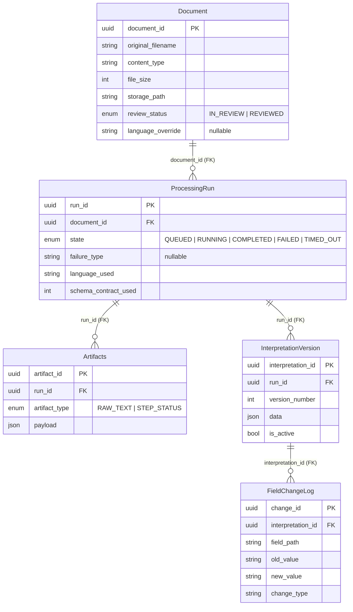

# B2. Minimal Persistent Data Model (Textual ERD)

This section defines the **minimum required persistent entities** and invariants.
It is **not** a SQL schema, but an authoritative structural contract.



Core-model scope note:
This ERD is intentionally limited to the 5 operational core entities required by ARCH-09. Additional governance/schema entities are specified normatively in B2.7-B2.9.

---

## B2.1 Document

**Purpose**: Represents an uploaded document.

Key fields:
- `document_id` (PK)
- `original_filename`
- `content_type`
- `file_size`
- `storage_path`
- `created_at`

Stored workflow fields:
- `review_status` (`IN_REVIEW | REVIEWED`)
- `language_override` (nullable; see B3.1 “Language override endpoint”)

Derived / external:
- `status` (derived; see Appendix A)

Invariants:
- A document must exist before any run.
- A document is never deleted.

---

## B2.2 ProcessingRun

**Purpose**: Represents one processing attempt.

Key fields:
- `run_id` (PK)
- `document_id` (FK)
- `state`
- `started_at`
- `completed_at`
- `failure_type` (nullable)
- `language_used`
- `schema_contract_used`

Invariants:
- Append-only.
- At most one `RUNNING` run per document (multiple `QUEUED` runs may exist).
- Terminal states are immutable.

---

## B2.3 Artifacts

**Purpose**: Stores run-scoped outputs (raw text, metadata).

Key fields:
- `artifact_id`
- `run_id` (FK)
- `artifact_type`
- `payload` (JSON or FS reference)
- `created_at`

Invariants:
- Artifacts are immutable.
- Artifacts are always linked to exactly one run.

### ArtifactType (Closed Set, normative)
- `RAW_TEXT` (filesystem reference)
- `STEP_STATUS` (JSON payload; Appendix C)

---

## B2.4 InterpretationVersion

**Purpose**: Versioned structured interpretation.

Key fields:
- `interpretation_id`
- `run_id` (FK)
- `version_number`
- `data` (JSON)
- `created_at`
- `is_active`

Invariants:
- Append-only.
- Exactly one active version per run.

---

## B2.5 FieldChangeLog

**Purpose**: Captures human edits.

Key fields:
- `change_id`
- `interpretation_id`
- `field_path`
- `old_value`
- `new_value`
- `change_type`
- `created_at`

Invariants:
- Append-only.
- Never blocks veterinarian workflow.

---

### B2.5.1 Field path format (Authoritative)
`field_path` MUST be stable across versions and MUST NOT rely on array indices.

Format (normative):
- `field_path = "fields.{field_id}.value"`

Notes:
- `field_id` refers to `StructuredField.field_id` in Appendix D.
- This allows a reviewer to trace changes even if the `fields[]` order changes between versions.
 
 ---

## B2.6 API Error Response Format & Naming Authority (Normative)

## API Error Response Format (Normative)
All API errors MUST return a JSON body with a stable, machine-readable structure:

```json
{
  "error_code": "STRING_ENUM",
  "message": "Human-readable explanation",
  "details": { "optional": "object" }
}
```

Rules:
- `error_code` is stable and suitable for frontend branching.
- `message` is safe for user display (no stack traces).
- `details` is optional and must not expose filesystem paths or secrets.

---

## API Naming Authority (Normative)
The authoritative endpoint map is defined in **Appendix B3 (+ B3.1)**.

If any user story lists different endpoint paths, treat them as non-normative examples and implement the authoritative map.

---

## B2.7 SchemaVersion (Authoritative)

**Purpose**: Stores canonical schema contract snapshots used by new processing runs.

Key fields:
- `schema_contract_id` (PK)
- `version_number` (monotonic integer)
- `schema_definition` (JSON)
- `created_at`
- `created_by` (reviewer identity)
- `change_summary` (nullable)

Invariants:
- Append-only; schema contract snapshots are immutable.
- “Current schema” is resolved as the schema contract snapshot with the highest `version_number`.
- New processing runs MUST persist `schema_contract_used` resolved at run creation time (B2.2).

---

## B2.8 StructuralChangeCandidate (Authoritative)

**Purpose**: Represents an aggregated, reviewer-facing candidate for schema evolution derived from repeated document-level edit patterns.

Key fields:
- `candidate_id` (PK)
- `change_type` (closed set; e.g. `NEW_KEY | KEY_RENAME | KEY_DEPRECATION | KEY_MAPPING`)
- `source_key` (nullable)
- `target_key`
- `occurrence_count`
- `status` (`PENDING | APPROVED | REJECTED | DEFERRED`)
- `created_at`
- `updated_at`
- `evidence_samples` (JSON; small, representative samples: page + snippet + optional document reference)

Invariants:
- Candidates are reviewer-facing only.
- Candidate details are never exposed in veterinarian workflows.
- Status changes MUST be traceable via append-only `GovernanceDecision` (B2.9).
- Candidate decisions apply prospectively only (Appendix A7).

---

## B2.9 GovernanceDecision (Authoritative)

**Purpose**: Append-only audit log of reviewer governance actions (schema evolution decisions).

Key fields:
- `decision_id` (PK)
- `candidate_id` (nullable)
- `decision_type` (closed set; `APPROVE | REJECT | DEFER | FLAG_CRITICAL`)
- `previous_status` (nullable)
- `new_status` (nullable)
- `schema_contract_id` (nullable; present when approval creates a new schema contract snapshot)
- `reviewer_id`
- `reason` (nullable)
- `created_at`

Invariants:
- Append-only and immutable.
- Stored separately from document-level data (Appendix A8).
- Reviewer actions never modify existing documents or trigger implicit reprocessing (Appendix A7).

---
