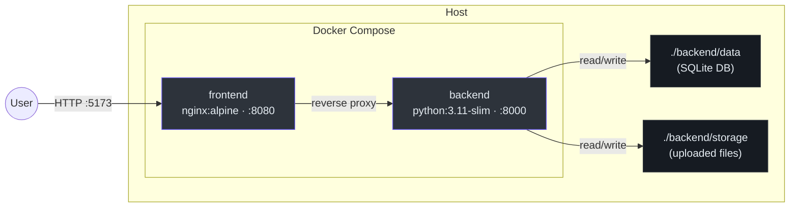

# Deployment Guide

> How the system is built, configured, and run. Covers Docker topology, environment
> variables, volume mounts, health checks, and operational modes.

## 1. Topology

The system runs as two Docker containers behind a single `docker compose` invocation.



<!-- Sources: docker-compose.yml, Dockerfile.backend, Dockerfile.frontend -->

| Service  | Base Image        | Container Port | Default Host Port | Health Check            |
| -------- | ----------------- | -------------- | ------------------ | ----------------------- |
| backend  | python:3.11-slim  | 8000           | 8000               | `GET /health/ready`     |
| frontend | nginx:alpine      | 8080           | 5173               | `wget http://127.0.0.1:8080/` |

## 2. Operating Modes

### 2.1 Evaluation Mode (default)

```bash
docker compose up --build
```

- Deterministic image builds (no source bind mounts).
- Frontend served as static build via nginx.
- Data persists across restarts via host-mounted volumes.
- Reset: `docker compose down` then delete `backend/data/` and `backend/storage/`.

### 2.2 Development Mode

```bash
docker compose -f docker-compose.yml -f docker-compose.dev.yml up --build
```

- Source code bind-mounted for live reload (uvicorn `--reload`, Vite HMR).
- Backend watches `backend/` and `shared/`.
- Frontend watches `frontend/` and `shared/`.
- Polling enabled for Windows/WSL2 compatibility (`CHOKIDAR_USEPOLLING`, `WATCHPACK_POLLING`).

### 2.3 Running Tests

```bash
# Backend (pytest)
docker compose --profile test run --rm backend-tests

# Frontend (vitest)
docker compose --profile test run --rm frontend-tests

# E2E (Playwright — requires running containers)
docker compose up -d --build
cd frontend && npx playwright test
```

## 3. Environment Variables

### 3.1 Ports & Networking

| Variable               | Default             | Purpose                                       |
| ---------------------- | ------------------- | --------------------------------------------- |
| `BACKEND_PORT`         | `8000`              | Host port mapped to backend container :8000   |
| `FRONTEND_PORT`        | `5173`              | Host port mapped to frontend container :8080  |
| `VET_RECORDS_CORS_ORIGINS` | `http://localhost,...` | Comma-separated allowed CORS origins      |
| `VITE_API_BASE_URL`    | `http://localhost:8000` | API endpoint used by the frontend build   |

### 3.2 Data & Storage

| Variable                  | Default                         | Purpose                       |
| ------------------------- | ------------------------------- | ----------------------------- |
| `VET_RECORDS_DB_PATH`     | `/app/backend/data/documents.db`| SQLite database file path     |
| `VET_RECORDS_STORAGE_PATH`| `/app/backend/storage`          | Uploaded file storage path    |
| `BACKEND_DATA_DIR`        | `./backend/data`                | Host directory for DB volume  |
| `BACKEND_STORAGE_DIR`     | `./backend/storage`             | Host directory for file volume|

### 3.3 Processing & Feature Flags

| Variable                                          | Default     | Purpose                                      |
| ------------------------------------------------- | ----------- | -------------------------------------------- |
| `VET_RECORDS_DISABLE_PROCESSING`                  | `False`     | Disable background document processing       |
| `VET_RECORDS_EXTRACTION_OBS`                      | `False`     | Enable extraction observability debug endpoints |
| `VET_RECORDS_INCLUDE_INTERPRETATION_CANDIDATES`   | `False`     | Include candidate debug payloads in artifacts |
| `PDF_EXTRACTOR_FORCE`                             | `""`        | Force a specific PDF extractor               |

### 3.4 Confidence Policy

| Variable                                           | Default     | Purpose                                   |
| -------------------------------------------------- | ----------- | ----------------------------------------- |
| `VET_RECORDS_CONFIDENCE_POLICY_VERSION`            | `v1-local`  | Confidence band policy identifier         |
| `VET_RECORDS_CONFIDENCE_LOW_MAX`                   | `0.50`      | Upper threshold for "low" confidence band |
| `VET_RECORDS_CONFIDENCE_MID_MAX`                   | `0.75`      | Upper threshold for "mid" confidence band |
| `VET_RECORDS_HUMAN_EDIT_NEUTRAL_CANDIDATE_CONFIDENCE` | `0.50`   | Confidence floor for human-edited values  |

### 3.5 Rate Limiting

| Variable                        | Default      | Purpose                    |
| ------------------------------- | ------------ | -------------------------- |
| `VET_RECORDS_RATE_LIMIT_UPLOAD` | `10/minute`  | Upload endpoint throttle   |
| `VET_RECORDS_RATE_LIMIT_DOWNLOAD`| `30/minute` | Download endpoint throttle |

### 3.6 Authentication

| Variable     | Default | Purpose                                                    |
| ------------ | ------- | ---------------------------------------------------------- |
| `AUTH_TOKEN`  | _(none)_ | Optional static bearer token. When unset, auth is disabled |

### 3.7 Runtime & Logging

| Variable         | Default | Purpose                   |
| ---------------- | ------- | ------------------------- |
| `LOG_LEVEL`      | `INFO`  | Python logging level      |
| `UVICORN_RELOAD` | _(none)_| Enable uvicorn auto-reload|

### 3.8 Build Metadata

| Variable      | Default   | Purpose                     |
| ------------- | --------- | --------------------------- |
| `APP_VERSION` | `dev`     | Embedded version string     |
| `GIT_COMMIT`  | `unknown` | Embedded commit SHA         |
| `BUILD_DATE`  | `unknown` | Embedded build timestamp    |

## 4. Volume Mounts

### 4.1 Evaluation Mode

| Container Path         | Host Path (default)    | Purpose                 |
| ---------------------- | ---------------------- | ----------------------- |
| `/app/backend/data`    | `./backend/data`       | SQLite database         |
| `/app/backend/storage` | `./backend/storage`    | Uploaded PDF files      |

### 4.2 Development Mode (additional)

| Container Path         | Host Path              | Purpose                 |
| ---------------------- | ---------------------- | ----------------------- |
| `/app/backend`         | `./backend`            | Source code (live reload)|
| `/app/shared`          | `./shared`             | Shared modules          |
| `/app/frontend`        | `./frontend`           | Source code (HMR)       |

## 5. Health Checks

Both containers include Docker health checks with identical timing:

| Parameter      | Value |
| -------------- | ----- |
| `interval`     | 10s   |
| `timeout`      | 5s    |
| `retries`      | 8     |
| `start_period` | 10s   |

The frontend container uses `depends_on: backend (service_healthy)` to wait for
the backend to be ready before starting.

The backend `stop_grace_period` is **45s**, and uvicorn uses a **30s** graceful
shutdown timeout (`--timeout-graceful-shutdown 30`).

## 6. Container Security

- Both containers run as non-root (`appuser`).
- Backend Dockerfile uses `STOPSIGNAL SIGTERM` for graceful shutdown.
- Test stage copies test files but switches back to `appuser` before running.
- Frontend nginx config is owned by `appuser:appgroup`.

## 7. Capacity & Constraints

This is a **technical assessment project** with a single-evaluator workload.
The following constraints are by design, not oversight.

| Constraint                         | Current Limit                  | Why                                                                                        |
| ---------------------------------- | ------------------------------ | ------------------------------------------------------------------------------------------ |
| Single-process model               | 1 API + 1 scheduler thread     | [ADR-ARCH-0004](adr/ADR-ARCH-0004-in-process-async-processing.md) — no external task queue |
| SQLite single-writer               | ~50 concurrent writes/s        | [ADR-ARCH-0002](adr/ADR-ARCH-0002-sqlite-database.md) — WAL + busy_timeout mitigate        |
| No horizontal scaling              | 1 container per service        | Monolith by design; worker profile path documented in ADR-0004                             |
| Processing timeout                 | 120s per document              | Hardcoded in orchestrator; sufficient for PDF sizes in scope                               |
| Max upload size                    | 20 MB per file                 | Validated at API layer; configurable                                                       |
| Rate limits                        | Upload 10/min, download 30/min | Via `slowapi`; configurable via env vars                                                   |
| Observability ring buffer          | 20 runs per document           | FIFO eviction; sufficient for trend analysis                                               |
| Intended concurrent users          | 1 (evaluator)                  | Demo/assessment workload                                                                   |

**Production evolution:** PostgreSQL adapter, Celery/RQ workers, connection
pooling, streaming uploads with early size rejection. See
[ADR-ARCH-0001](adr/ADR-ARCH-0001-modular-monolith.md) for the migration path.

## 8. Related Documents

| Document                                                     | Relationship                               |
| ------------------------------------------------------------ | ------------------------------------------ |
| [architecture.md](architecture.md)                           | System overview and tech stack             |
| [technical-design.md](technical-design.md)                   | Data persistence and processing rules      |
| [ADR-ARCH-0001](adr/ADR-ARCH-0001-modular-monolith.md)       | Why single-process monolith                |
| [ADR-ARCH-0004](adr/ADR-ARCH-0004-in-process-async-processing.md) | Why in-process scheduler (no Celery) |
