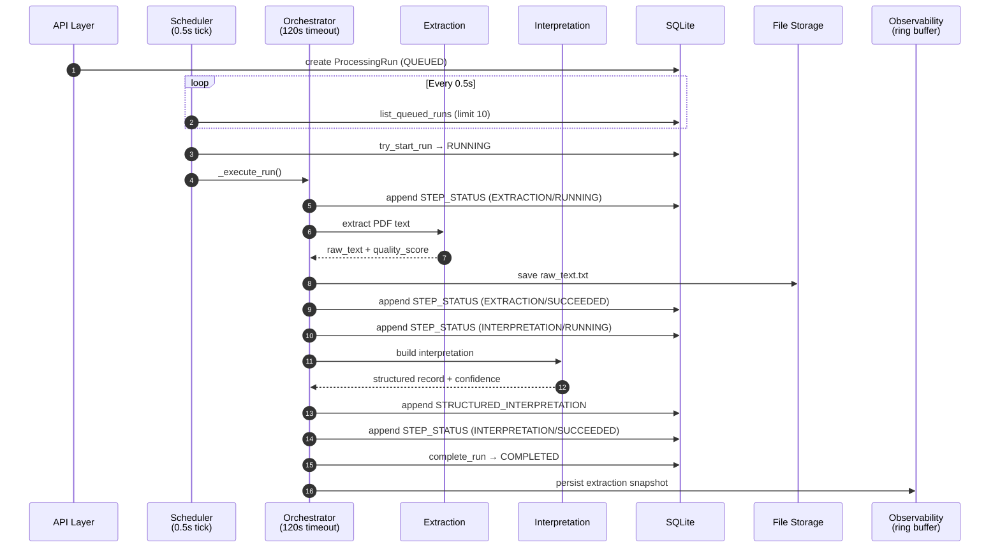
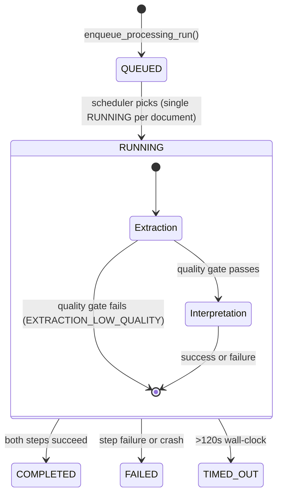
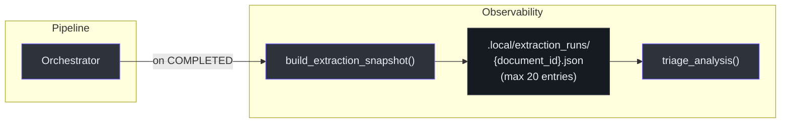
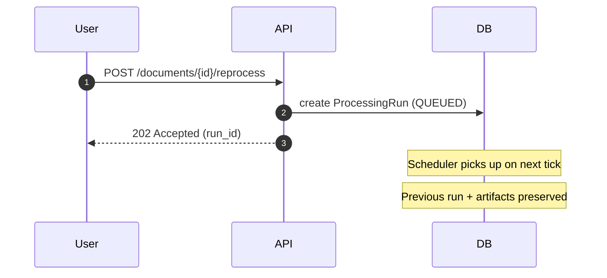

# Event & Processing Architecture

> How documents flow through the processing pipeline, what events are emitted,
> what artifacts are persisted, and how the extraction observability system tracks
> quality over time.

## 1. Pipeline Overview

Every uploaded PDF goes through a two-step pipeline: **Extraction** (PDF → raw
text) and **Interpretation** (raw text → structured medical record). The pipeline
is orchestrated in-process via an async scheduler.



<!-- Sources: backend/app/application/processing/orchestrator.py, backend/app/application/processing/scheduler.py -->

## 2. Pipeline Steps

### 2.1 Extraction

| Aspect        | Detail                                                               |
| ------------- | -------------------------------------------------------------------- |
| Input         | PDF file from storage                                                |
| Output        | Raw text string                                                      |
| Persistence   | `raw_text.txt` in file storage                                       |
| Quality gate  | `evaluate_extracted_text_quality()` — fails with `EXTRACTION_LOW_QUALITY` if below threshold |
| Extractors    | Multiple (pypdf, pdfminer); selectable via `PDF_EXTRACTOR_FORCE`     |

### 2.2 Interpretation

| Aspect        | Detail                                                               |
| ------------- | -------------------------------------------------------------------- |
| Input         | Raw text from extraction step                                        |
| Output        | `STRUCTURED_INTERPRETATION` artifact                                 |
| Sub-steps     | Candidate mining → schema mapping → normalization → validation → confidence calibration |
| Schema        | `visit-grouped-canonical` (24 fields)                                |
| Confidence    | Per-field confidence (0–1) using policy bands (low/mid/high)         |

## 3. Artifact Types

All artifacts are **append-only** — once persisted, they are never modified.

| Artifact Type                | Payload                                      | Storage   | Cardinality  |
| ---------------------------- | -------------------------------------------- | --------- | ------------ |
| `STEP_STATUS`                | Step lifecycle event (name, status, error)   | SQLite    | 2–4 per run  |
| `STRUCTURED_INTERPRETATION`  | Full structured medical record with metadata | SQLite    | 0–1 per run  |
| Raw text                     | Extracted PDF text                           | File system | 0–1 per run |

### 3.1 STEP_STATUS Payload

```json
{
  "step_name": "EXTRACTION | INTERPRETATION",
  "step_status": "RUNNING | SUCCEEDED | FAILED",
  "attempt": 1,
  "started_at": "ISO-8601",
  "ended_at": "ISO-8601 | null",
  "error_code": "EXTRACTION_FAILED | EXTRACTION_LOW_QUALITY | INTERPRETATION_FAILED | null"
}
```

### 3.2 STRUCTURED_INTERPRETATION Payload

```json
{
  "interpretation_id": "uuid",
  "version_number": 1,
  "data": {
    "document_id": "uuid",
    "processing_run_id": "uuid",
    "schema_contract": "visit-grouped-canonical",
    "fields": [
      { "key": "pet_name", "value": "Rex", "confidence": 0.92,
        "evidence": { "page": 1, "snippet": "Paciente: Rex" } }
    ],
    "global_schema": { "pet_name": ["Rex"], "species": ["Canine"] },
    "summary": {
      "total_keys": 24, "populated_keys": 18,
      "keys_present": ["..."], "warning_codes": []
    },
    "confidence_policy": {
      "policy_version": "v1.0",
      "band_cutoffs": { "low_max": 0.6, "mid_max": 0.8 }
    }
  }
}
```

## 4. Event Taxonomy

The system emits structured log events for observability and audit trail.

### 4.1 Processing Events

| Event                    | Trigger                         | Contains          |
| ------------------------ | ------------------------------- | ----------------- |
| `REPROCESS_REQUESTED`    | `POST /documents/{id}/reprocess`| document_id, run_id |

### 4.2 Access Events

| Event                                  | Trigger                               |
| -------------------------------------- | ------------------------------------- |
| `DOCUMENT_LIST_VIEWED`                 | `GET /documents`                      |
| `DOCUMENT_METADATA_VIEWED`             | `GET /documents/{id}`                 |
| `DOCUMENT_PROCESSING_HISTORY_VIEWED`   | `GET /documents/{id}/runs`            |
| `DOCUMENT_ORIGINAL_ACCESSED`           | `GET /documents/{id}/original`        |
| `DOCUMENT_ORIGINAL_ACCESS_FAILED`      | Download failure                      |
| `DOCUMENT_REVIEW_VIEWED`              | View review page                      |
| `RAW_TEXT_ACCESSED`                    | `GET /runs/{run_id}/artifacts/raw-text`|
| `RAW_TEXT_ACCESS_FAILED`              | Raw text fetch failure                |
| `INTERPRETATION_EDITED`               | Edit structured interpretation values |

## 5. State Machine

Processing runs follow a strict state machine (see
[technical-design.md Appendix A1](technical-design.md#a1-state-model--source-of-truth)
for the authoritative contract).



<!-- Sources: backend/app/domain/models.py (ProcessingRunState), backend/app/application/processing/orchestrator.py -->

### Failure Types

| `failure_type`              | Cause                                    |
| --------------------------- | ---------------------------------------- |
| `EXTRACTION_FAILED`         | PDF text extraction error                |
| `EXTRACTION_LOW_QUALITY`    | Extracted text below quality threshold   |
| `INTERPRETATION_FAILED`     | Structured data interpretation error     |
| `PROCESS_TERMINATED`        | Crash recovery — orphaned RUNNING run    |

## 6. Extraction Observability

A per-document **ring buffer** tracks the last 20 processing runs to enable trend
analysis and quality monitoring.



<!-- Sources: backend/app/application/processing/extraction_observability/ -->

### 6.1 Snapshot Structure

Each entry in the ring buffer captures:

- **Per-field status:** accepted, rejected, missing
- **Confidence band:** low / mid / high
- **Top candidates:** up to N candidates with raw value, confidence, and source hint
- **Aggregate counts:** total fields, populated, accepted, rejected, missing

### 6.2 Triage Analysis

The triage system flags:

- **Missing fields** — expected fields with no candidates
- **Rejected fields** — human-rejected values
- **Suspicious accepts** — accepted values with implausible data (e.g., weight out of range)

### 6.3 Enabling Observability Endpoints

Set `VET_RECORDS_EXTRACTION_OBS=True` to expose debug endpoints for observability
data access. Disabled by default.

## 7. Reprocessing

Reprocessing creates a **new** `ProcessingRun` in `QUEUED` state. The previous run
and its artifacts are preserved (append-only history).



<!-- Sources: backend/app/application/processing/scheduler.py (enqueue_processing_run) -->

Key rules:
- If a run is already `RUNNING`, the new run stays `QUEUED` until it finishes.
- Reprocessing does **not** change the document's `review_status`.
- Each run produces independent artifacts — no overwriting.

## 8. Related Documents

| Document                                                          | Relationship                              |
| ----------------------------------------------------------------- | ----------------------------------------- |
| [technical-design.md](technical-design.md)                        | State contracts (Appendix A1), processing rules (§3) |
| [architecture.md](architecture.md)                                | System diagram and layer overview         |
| [extraction-quality.md](extraction-quality.md)                    | Quality evaluation details                |
| [ADR-ARCH-0004](adr/ADR-ARCH-0004-in-process-async-processing.md)| Why in-process async (no Celery/RQ)       |
| [ADR-ARCH-0008](adr/ADR-ARCH-0008-confidence-scoring-algorithm.md)| Confidence scoring algorithm design       |
