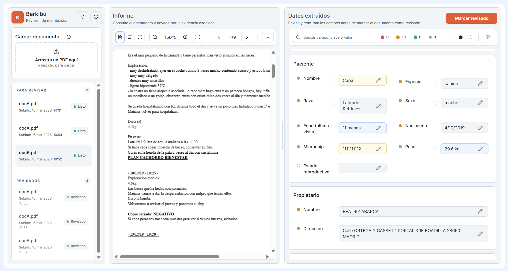

# Veterinary Medical Records Wiki
This wiki contains curated project documentation for technical evaluation.

## Evaluator Reading Path

| Evaluation axis | Suggested path |
|---|---|
| **First steps** | [Deployment](deployment) → [User Guide](user-guide) |
| **Key documentation** | [Product Design Executive Summary](product-design-executive) → [Product Design](product-design) → [Event Architecture](event-architecture) → [Extraction Quality](extraction-quality) |
| **Architecture & design** | [Architecture](architecture) → [Technical Design](technical-design) → [ADRs](adr-index) |
| **Iterative & incremental approach** | [Implementation Plan](implementation-plan) → [Implementation History](implementation-history) → [Quality Audit History](quality-audit-history) → [Future Improvements](future-improvements) |
| **Post mortem** | [Post Mortem](post-mortem) |
| **Additional reading** | [Staff Engineer Guide](staff-engineer-guide) — 15/30/45 min reading paths |

---

## Project Documentation

### 01 Product

- [Product Design Executive Summary](product-design-executive) — one-page, business-focused overview for evaluators and stakeholders
- [Product Design](product-design) — vision, strategy, human-in-the-loop philosophy, conceptual model
- [Post Mortem](post-mortem) — placeholder for the final retrospective and lessons learned
- [User Guide](user-guide) — what the app does and how to try it
- [Staff Engineer Guide](staff-engineer-guide) — evaluator-oriented deep dive with 15/30/45 min reading paths
- [Product Specifications](product-specs) — full product design, UX design, design system

### 02 Tech

- [Architecture](architecture) — modular monolith, module boundaries, data flow
- [Technical Design](technical-design) — extraction pipeline, confidence scoring, schema governance
- [Extraction Quality](extraction-quality) — quality metrics, confidence calibration, error taxonomy
- [Event Architecture](event-architecture) — async processing, event bus, state machine
- [Deployment](deployment) — Docker Compose, environment config, health checks
- [API Reference ↗](http://localhost:8000/docs) — interactive Swagger UI (requires running backend)
- [Architecture Decision Records](adr-index) — 11 ADRs covering key technical choices
- [Tech Specifications](tech-specs) — full technical design, backend & frontend implementation

### 03 Ops

- [Manual QA Regression Checklist](manual-qa-regression-checklist) — structured manual testing protocol
- [Plan E2E Test Coverage](plan-e2e-test-coverage) — Playwright test strategy and coverage goals
- [Architecture Audit Process](architecture-audit-process) — systematic quality evaluation methodology

### 04 Delivery

- [Implementation Plan](implementation-plan) — user stories, work breakdown, prioritization
- [Implementation History](implementation-history) — chronological build log with decisions
- [Quality Audit History](quality-audit-history) — audit scores, findings, remediation tracking
- [Future Improvements](future-improvements) — roadmap and technical debt backlog

## Shared Documentation

Cross-project standards and guidelines that apply to all projects in this organization, not only to this project.

- [Way of Working](way-of-working) — development workflow, PR process, CI/CD
- [Coding Standards](coding-standards) — Python and TypeScript conventions, linting rules
- [Documentation Guidelines](documentation-guidelines) — writing style, structure, templates
- [UX Guidelines](ux-guidelines) — interaction patterns, accessibility, responsive behavior
- [Brand Guidelines](brand-guidelines) — colors, typography, visual identity

