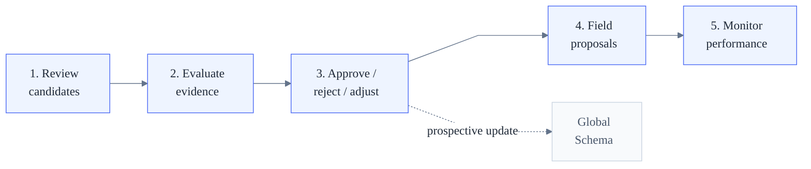
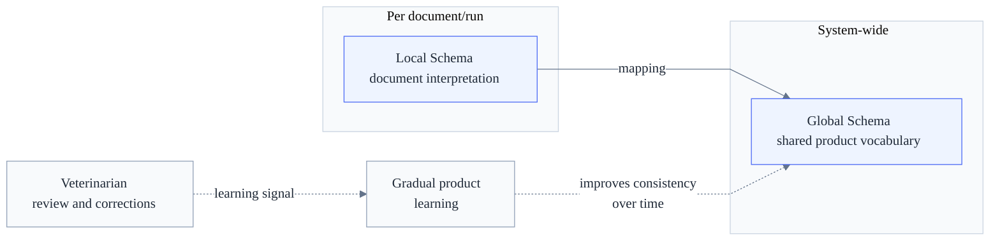

# Product Design — Document Interpretation & Layout Evolution

> **How to read this page**
>
> This document defines the **product meaning** — what the system does and why — without prescribing
> implementation or UI layout.
>
> | Part                        | Sections | Focus                                                              |
> | --------------------------- | -------- | ------------------------------------------------------------------ |
> | **Problem & goal**          | §1 – §3  | What problem we solve, for whom, and what success looks like.      |
> | **Product principles**      | §4       | The rules that govern our product decisions.                 |
> | **Veterinarian experience** | §5       | Step-by-step review workflow from the user's perspective.          |
> | **Confidence**              | §6       | What confidence means as a product signal.                        |
> | **Conceptual model**        | §7       | Local/Global Schema and how meaning becomes shared.               |
> | **Learning & governance**   | §8       | Structural signals, non-reversibility, safety boundaries.         |
> | **Deployment strategy**     | §9       | Shadow mode, progressive automation, zero-friction introduction.  |
> | **Observability**           | §10      | Degradation detection, guardrails, the learning test.             |
>
> **Authority boundaries:**
> - Executive summary (one-page business overview) → [Product Design — Executive Summary](product-design-executive)
> - Product design extended (appendices, full schema, panel semantics) → [Product Design Extended](product-design-full)
> - UX interaction contract (full detail) → [specs/ux-design.md](ux-design)
> - Visual design system → [specs/design-system.md](Design-System)
> - Architecture, persistence, and API contracts → [technical-design.md](technical-design)
> - Implementation scope and sequencing → [implementation-plan.md](implementation-plan)

---

## 1. Problem

Veterinary clinics process medical documents — invoices, lab reports, referral letters — as part of daily clinical
and operational work. These documents are unstructured, inconsistent across sources, and must be reviewed under time
pressure.

Today that review is entirely manual: the veterinarian reads each document, mentally extracts the relevant
information, and decides what matters. This is repetitive, error-prone, and impossible to scale.

The opportunity is to **assist that review process** so that it becomes faster, more consistent, and progressively
smarter — without changing how veterinarians work or asking them to take responsibility for system behavior.

### Users

- **Veterinarian** (primary user): reviews uploaded medical records, inspects extracted and structured data, corrects
  errors, and makes final decisions with full traceability.
- **Reviewer** (future role): oversees system-level patterns and consistency across documents and clinics. Never
  participates in individual document review.

Out of scope for MVP: pet owners, external clinics, administrative staff.

### Example usage

**Veterinarian — daily document review**

A veterinarian receives a referral letter from an external specialist. Instead of reading the full document to extract the relevant data manually, they open the system, upload the PDF, and see the structured interpretation alongside the original. The system has already identified the diagnosis, the medications prescribed, and the follow-up dates — with confidence indicators for each field. The vet scans the output, notices the diagnosis was misclassified, corrects it in one click, and marks the document as reviewed. Total time: under two minutes. Nothing extra is asked of them.

**Reviewer — periodic governance**

The reviewer is a non-clinical role — typically someone in operations or product — responsible for overseeing how the system evolves across all documents and clinics. They never touch individual records; their job is to evaluate whether system-wide patterns are reliable enough to become permanent defaults.

Most of the time, the reviewer is not needed at all. When veterinarians across many records consistently accept the same interpretation, the system promotes that mapping automatically once it crosses a confidence threshold — no approval required.

The reviewer only steps in for changes that carry clinical, financial, or legal weight. For example: if veterinarians are consistently reclassifying a value the system labels "symptom" into "confirmed diagnosis" — a medically significant change — the system flags it for human review rather than self-promoting. The reviewer evaluates the evidence, inspects representative examples, and decides to approve, reject, or adjust. That decision takes effect prospectively; past documents are never rewritten.

This design keeps the reviewer off the critical path for the vast majority of corrections, while preserving human oversight exactly where the cost of error is highest.

---

## 2. Product Goal

Reduce the cognitive and mechanical load on veterinarians while transforming unavoidable corrections into structured
signals that allow the system to improve incrementally and safely over time.

Success is not defined by full automation, but by:

- **faster reviews** — less time per document,
- **fewer repetitive actions** — the system handles what it can,
- **higher confidence in system outputs** — veterinarians can trust more and check less,
- **a clear path toward scalable automation** — every review cycle makes the system better.

---

## 3. Design Premise

The system does not learn medical semantics. **The system learns operational consistency.**

Individual veterinary actions are contextual and potentially noisy. Value emerges only when similar corrections
repeat under similar conditions. The system improves based on patterns, stability, and accumulated evidence — not
on single decisions.

The veterinarian:

- does not give explicit feedback,
- does not train the system,
- does not change how they work.

They simply do their normal job — review, correct, confirm. The system **observes passively** and converts that
work into learning signals. This means zero friction, zero additional cost, and zero operational risk for the
clinician.

---

## 4. Product Principles

### 4.1 Assistance before automation

The system assists interpretation but never replaces medical judgment. Automation is considered only once sufficient
evidence of stability exists, and only where behavior is well understood, explainable, and reversible.

### 4.2 Visibility over magic

The system must clearly show what it understands, what it is unsure about, and where human input is needed.
Uncertainty is made explicit, never hidden. All meaningful changes remain observable and auditable.

### 4.3 Zero-friction correction

Veterinarians must be able to correct the system immediately, without approval workflows or additional steps. Speed
is critical. The system's learning needs must never slow down clinical work.

### 4.4 Controlled learning

Corrections can influence future behavior, but never silently. Structural changes are proposed, not automatically
applied. The system reacts quickly to instability and cautiously to apparent correctness.

This strategy deliberately prioritizes safety over speed, clarity over automation depth, and evolvability over
premature optimization.

---

## 5. Veterinarian Experience (MVP)

This section describes the review workflow from the veterinarian's perspective — what they see and do at each step,
and why the product is designed that way.

### Step 1 — Upload & processing visibility

The veterinarian uploads a PDF medical document. The system immediately provides a clear processing state and
visibility into whether the document is ready for review. This removes uncertainty and waiting.

### Step 2 — Interpretation presented for review

The system presents three things together, never split across screens:

- the **original document**,
- the **extracted raw text**,
- and a **structured medical record** — the system's current interpretation, not ground truth.

### Step 3 — Confidence-guided attention

Each structured field includes a confidence indicator. This allows the veterinarian to focus attention where it
matters, trust high-confidence data, and quickly spot likely errors. Confidence never blocks or forces decisions;
it only guides where to look first.

### Step 4 — Immediate correction

The veterinarian can edit incorrect values, reassign information to a different field, or identify information that
does not fit the existing structure. Corrections apply instantly to the current case, so work continues without
interruption. The veterinarian is never slowed down by the system's learning needs.

### Step 5 — Completion and implicit learning

A single **Mark as reviewed** action completes the review. Behind the scenes, the system records any corrections as
signals for future improvement — but from the veterinarian's perspective, nothing extra happens. No approval step,
no explicit feedback, no responsibility for system-wide decisions.

```mermaid
%%{init: {"theme":"base","themeVariables":{"primaryColor":"#eef4ff","primaryTextColor":"#1f2937","primaryBorderColor":"#4f6df5","lineColor":"#64748b","secondaryColor":"#ffffff","tertiaryColor":"#f8fafc","clusterBkg":"#f8fafc","clusterBorder":"#cbd5e1","edgeLabelBackground":"#ffffff","fontFamily":"Segoe UI, sans-serif"},"flowchart":{"curve":"linear"}}}%%
flowchart LR
    S1["1. Upload doc"] --> S2["2. Review interpretation<br>+ confidence"]
    S2 --> S3["3. Correct locally"]
    S3 --> S4["4. Mark as reviewed"]
    S4 -.->|"lightweight signal"| SYS["System<br>learning"]

    style S1 fill:#eef4ff,stroke:#4f6df5,color:#1f2937
    style S2 fill:#eef4ff,stroke:#4f6df5,color:#1f2937
    style S3 fill:#eef4ff,stroke:#4f6df5,color:#1f2937
    style S4 fill:#eef4ff,stroke:#4f6df5,color:#1f2937
    style SYS fill:#f8fafc,stroke:#cbd5e1,color:#475569
```

### Confidence visibility

Confidence is shown as a **qualitative signal** (visual weight, emphasis) at a glance. Numeric detail is secondary,
accessible via tooltips. The rule: confidence guides _where to look first_, not _what to decide_.

> **Full UX contract** (rendering rules, label tables, tooltip breakdown, empty states, reviewer interaction model,
> sensitive changes policy) → [specs/ux-design.md](ux-design)
>
> **Visual design system** (CSS tokens, component primitives, accessibility rules) →
> [specs/design-system.md](Design-System)

---

## 5b. Reviewer Experience (Future)

This section describes the governance workflow from the reviewer's perspective — what they see and do, and how
system-level meaning evolves under human oversight. The reviewer never touches individual documents; they work
with **aggregated patterns** surfaced by the system.

> This role is not implemented in the MVP. Structural signals are stored during MVP but reserved for this
> future workflow (see [Safety in MVP](#safety-in-mvp)).

### Step 1 — Dashboard of aggregated candidates

The reviewer opens a dashboard showing **candidates** — mappings or field evolution proposals grouped by pattern,
context, and accumulated evidence. Each candidate includes representative examples, consistency metrics, and an
impact classification (e.g. clinical, financial, structural). The reviewer never sees raw corrections; they see
distilled patterns that have crossed the system's evidence threshold.

### Step 2 — Evaluate evidence and impact

For each candidate, the reviewer inspects:

- **Evidence summary** — how many corrections, across how many documents, clinics, and time periods.
- **Consistency metrics** — how uniform the pattern is (a 95 % consistency across 200 documents is stronger than
  100 % across 5).
- **Impact classification** — the system categorizes the candidate by sensitivity (clinical data, financial data,
  structural change). Higher-impact candidates require stricter thresholds and cannot be auto-promoted.

### Step 3 — Decide: approve, reject, or adjust

The reviewer makes one of three choices:

- **Approve** — the change takes effect **prospectively** (past documents are never rewritten). For a
  **mapping candidate**, the default mapping rule for that context is updated — future documents matching the
  same context will use the approved mapping. For a **field proposal**, a new field is added to the Global
  Schema (see Step 4).
- **Reject** — the candidate is dismissed. The system stops accumulating evidence for that specific pattern.
- **Adjust** — the reviewer modifies naming, placement, or classification before approving (common for field
  proposals where veterinarians created the value but not the taxonomy).

> **Example:** Across many Spanish-language medical records from a clinic, veterinarians consistently reclassify
> a value the system extracts as "symptom" into the "confirmed diagnosis" field. The system presents this as a
> mapping candidate with clinical impact (therefore **critical**). The reviewer evaluates the evidence and
> approves — from that point on, future documents matching the same context (Spanish-language records from that
> clinic) will map that value to "confirmed diagnosis" by default. Past documents remain unchanged.

### Step 4 — Field proposals

When veterinarians consistently create values for fields that do not exist in the Global Schema, the system
captures these as **field proposals**. Field proposals always require reviewer approval — the reviewer decides
naming, placement, and classification. Approved fields enter the Global Schema with a neutral policy state
and begin accumulating their own confidence from that point forward.

### Step 5 — Extraction performance monitoring

The reviewer uses aggregated correction and confidence data to observe which extraction strategies perform well
and which need attention. The system surfaces per-mapping accept/edit ratios and confidence trends. This
visibility is **diagnostic only** — it informs human prioritization but never triggers automatic changes.

### Separation of responsibilities

- **Veterinarians** — resolve individual documents, correct and validate locally, never manage system behavior.
- **Reviewers** — oversee system-level meaning, review aggregated patterns, never participate in document workflows.

This separation is intentional, asymmetric, and non-negotiable. No user is responsible for both document resolution
and system governance within the same workflow.

---

## 6. Confidence as a Product Signal

Confidence is a **signal about interpretation stability**, not a decision or a truth claim.

- Confidence guides attention and prioritization; it never blocks decisions or actions.
- Confidence reflects **consistency across similar contexts over time** — not how frequently a value appears. A field
  that is chosen often but contradicted regularly should not be considered stable.
- Confidence may decrease faster than it increases when new contradictory evidence appears.
- A single correction is treated as a **weak signal**, not as ground truth. Confidence should never overreact to
  isolated events, small user groups, or short periods of activity.
- There are two distinct confidence concepts: **extraction confidence** (how certain the system is about one
  interpretation in one run) and **mapping confidence** (how stable a mapping appears across similar situations over
  time). They serve different purposes and must not be conflated.
- Confidence does not belong to a field in the abstract. It is assigned to a **mapping observed in context**
  (see §7 definition). The same field may carry different confidence in different contexts.
- All confidence-based effects are soft, gradual, and fully reversible. If patterns change or are invalidated,
  confidence adjusts accordingly and recommendations disappear — without rewriting past decisions.

---

## 7. Conceptual Model: From Document Interpretation to Shared Meaning

At product level, the goal is simple: turn one document's interpretation into something clinicians can review quickly
and the system can understand consistently over time.

- **Field:** a semantic unit of information (e.g. diagnosis, medication name, treatment date). A field may exist
  in the Local Schema (detected in one document), in the Global Schema (standardized), or in both.
- **Local Schema:** the structured interpretation for one document — the set of fields detected in that specific
  run, with their values, evidence, and confidence.
- **Global Schema:** the shared vocabulary the product uses to present similar concepts consistently across
  documents. On day one, the team defines an initial Global Schema (v0) with a baseline set of standardized
  fields. Over time, accumulated evidence and governance decisions may incorporate new fields or retire existing
  ones — but every change to the Global Schema follows governance rules, never emerges automatically.
- **Mapping:** the contextual relationship between a field detected in a document and a standardized field in the
  shared vocabulary. A mapping is always scoped to a **context** (see below). Mapping is what allows the system
  to generalize safely across documents and contexts.
- **Context:** the combination of observable conditions under which a document is processed — such as document
  type, language, country, and clinic. Context determines which mappings and confidence values apply. The same
  field may carry different confidence or map differently depending on context.

This section explains the meaning of the model, not its storage shape, API contract, or learning mechanics.

### Visit interpretation in MVP

- A **visit** is one care episode identified primarily by its date, with optional admission/discharge dates and
  reason.
- Clinical concepts are **visit-scoped**: the product treats them as belonging to a specific care episode rather than
  to the record as a whole.
- The UI should reflect the structure provided by the interpretation, not invent its own visit grouping logic.
- MVP excludes cross-document deduplication and longitudinal visit tracking.
- Review completion is **document-level**: **Mark as reviewed** applies to the full document including all visits.

> Specification-level detail (canonical field inventory, panel semantics) is in
> [product-design-full.md](product-design-full) Appendix A and Appendix B.
> Technical contracts and implementation mechanics remain in [technical-design.md](technical-design).

---

## 8. Learning, Governance & Safety

### How the system learns

- Reviewed documents contribute to gradual improvement, so repeated human review work becomes long-term product value.
- The product learns conservatively from repeated patterns, not from isolated corrections.
- Review stays lightweight for veterinarians; the system learns from normal review activity without asking for extra
  feedback steps.
- Shared meaning may improve over time, but product-wide changes must remain controlled and auditable.

### Progressive impact

Confidence translates to system behavior in graduated steps:

- **Low confidence** — effect is local only. The system presents its interpretation but makes no recommendations
  beyond the current document.
- **Medium confidence** — the system may offer non-binding recommendations for similar future documents, clearly
  marked as suggestions.
- **High confidence** — the mapping becomes an operational default for new documents in similar contexts, while
  remaining fully traceable and reversible.

### Structural signals

Some human actions carry **system-level meaning** beyond a single document. A structural signal represents a
**repeated, semantically similar correction** observed across multiple documents under comparable conditions.

Structural signals are accumulated over time, evaluated in aggregate, and never trigger automatic system changes.
When those signals indicate a potential need for intervention, they inform governance decisions for future behavior
only. They never block veterinary workflows, never rewrite past interpretations, and never create hidden operational
burden for clinicians.

### Non-reversible changes

Not all structural changes are equal. Some are considered **non-reversible** — not because they cannot be undone
technically, but because reverting them safely would mean re-evaluating past decisions, reinterpreting historical
data, or accepting legal and operational risk.

A change is non-reversible when:

- it can influence downstream decisions once introduced,
- it can be stored and reused across historical records,
- or it changes the semantic meaning of data already processed.

In other words: **a change is non-reversible if its presence could have altered a past decision.** This definition
is intentionally conservative. Non-reversible changes must never be auto-promoted, regardless of confidence
thresholds, and always require explicit review.

### Categories of non-reversible change

**Critical concepts** — fields or entities that can affect coverage or eligibility decisions, have direct economic
implications, or carry medical or legal meaning on their own (e.g. pre-existing condition, confirmed diagnosis,
emergency procedure, experimental treatment, covered amount, reimbursable cost). Once such a concept exists, it may
be used in claim decisions, persisted in historical records, or interpreted by other systems. If later reverted,
past decisions may no longer be valid and historical data may change meaning. Critical concepts are defined
explicitly by product policy — never inferred dynamically — and cannot emerge automatically from observed
corrections. Edits affecting critical concepts always apply locally and immediately, generate high-priority
structural signals, and never block document review.

**Business rules** — any logic that affects claim eligibility, coverage determination, prioritization,
classification, or downstream processing flows (e.g. fast-tracking emergency procedures, applying partner
reimbursement models, requiring additional review above a threshold). Business rules produce side effects —
approvals, financial calculations, customer communications, operational actions. Even if a rule is later reverted,
its effects have already occurred. Reversing them safely would require auditing past decisions, recalculating
outcomes, and potentially correcting customer-facing results.

**Economic decisions** — determining which amounts are reimbursable, defining the base for financial calculation,
or assigning monetary meaning to extracted values. Once money has been calculated, communicated, or paid, there is
no safe automatic undo. Any change that can influence financial outcomes is non-reversible.

**Medical interpretation** — distinguishing diagnosis from symptoms, classifying treatments or procedures, or
inferring clinical severity. These interpretations may influence medical judgment, claim acceptance, and legal
accountability. Because of their sensitivity and downstream impact, medical interpretations are never auto-promoted.

### Design constraint

Only changes that:

- do not alter the meaning of data,
- do not affect economic or medical decisions,
- and do not invalidate historical interpretation

may be promoted automatically based on confidence. All other changes require human review.

Examples of changes that **can** self-promote when confidence is sufficient: mappings between existing fields,
aliases and synonyms, and soft reorganizations with no downstream impact. These are inherently reversible and
do not alter the semantic meaning of past data.

**Summary principle:** if a change can affect money, coverage, or medical interpretation, it cannot self-promote.
This ensures the system improves safely, without trading scalability for irreversible risk.

### Two-tier governance

Requiring reviewer approval for every correction pattern would make the reviewer a throughput bottleneck.
The system processes far more documents than any reviewer can individually supervise.

The governance model splits into two tiers based on **reversibility and downstream impact**, not on
confidence alone:

**Self-promoting changes** — mappings between existing fields, synonyms, ranking adjustments, and other
changes that do not alter the meaning of past data. When accumulated evidence meets the confidence
threshold, these adjust system defaults automatically. If the adjustment is wrong, veterinarians will
correct it, confidence decreases, and the system reverts. The feedback loop is closed without governance
intervention.

**Mandatory-review changes** — new Global Schema fields, critical concept reclassifications, and any
change that affects financial, medical, or legal semantics. These always require explicit reviewer
approval, regardless of confidence level. A mapping with 99% confidence that affects financial semantics
still requires reviewer action.

This keeps the reviewer **off the critical path** for the majority of corrections while preserving human
oversight where the cost of error is highest.

### Governance boundaries

- Product-wide meaning evolves prospectively only; it must never silently rewrite past documents.
- Veterinarian workflow never carries governance burden; stricter handling applies only to governance decisions.

### Safety in MVP

Structural changes identified during review are not applied globally in the MVP. Instead, they are stored as
explicit, reviewable signals and reserved for a future operator workflow. This ensures veterinarians are empowered
but not burdened, and the system evolves safely and consistently.

### Separation of responsibilities

See [§5b Reviewer Experience](#5b-reviewer-experience-future) for the full role definition and workflow.
In summary: veterinarians resolve individual documents; reviewers govern system-level meaning. The two roles
never overlap within the same workflow.

### Reviewer workflow (illustrative example)

The full reviewer workflow is described in [§5b](#5b-reviewer-experience-future). The following example
illustrates how governance works in practice.

Example: across a large number of Spanish-language medical records from a specific clinic, veterinarians
consistently reclassify a value the system extracts as "symptom" into the standardized "confirmed diagnosis"
field. The system aggregates these corrections, calculates consistency, and presents the pattern as a
candidate — including representative examples, consistency metrics, and an impact classification (in this case:
clinical, therefore **critical**). Because the impact is critical, the system does not auto-promote. The
reviewer evaluates the evidence and decides: approve, reject, or adjust. That decision updates the Global
Schema prospectively — past documents are never rewritten.

---

## 9. Deployment Strategy

The system can be introduced with **zero friction** because it is designed to operate in progressive stages:

| Stage | What happens | Risk |
|-------|-------------|------|
| **Shadow mode** | System runs in parallel alongside existing workflows. It observes, extracts, and scores — but makes no decisions and changes nothing. Veterinarians are unaware of it. | None — no user-facing impact. |
| **Passive learning** | Human work (corrections, acceptances, overrides) is captured as structured evidence. The system builds a contextual dataset — real documents, real clinics, real countries — without interfering. | None — observation only. |
| **Assisted suggestions** | The system begins surfacing suggestions to veterinarians: "In documents like this, this field is accepted 98% of the time." Veterinarians accept or correct; the system learns from the pattern. | Low — suggestions are advisory, never binding. |
| **Progressive automation** | Fields and mappings with sustained high confidence and stable guardrails are promoted to automatic. Automation expands only where evidence supports it. | Controlled — guardrails gate every promotion. |

Each stage transition is a deliberate organizational decision, not a system threshold. The modular monolith already preserves the module boundaries needed for this evolution (see [Target architecture](architecture)).

**Key insight:** the veterinarian's work is not wasted effort — it is the system's primary input. Every correction, acceptance, and override becomes structured evidence that improves future accuracy. The system learns because each cycle requires less human intervention to maintain the same quality level.

---

## 10. Observability & Degradation Prevention

A learning system must prove it is improving — and detect when it is not — before problems reach users.

### What the system monitors

| Signal | What it detects | Response |
|--------|----------------|----------|
| **Override rate** per field/context | Veterinarians rejecting automatic suggestions at increasing rates | Confidence decreases; field routed back to human review |
| **Confidence vs. acceptance divergence** | System believes it is right, but humans disagree | Recalibration triggered; may indicate extractor drift or new document patterns |
| **Review time trends** | Veterinarians spending more time reviewing — a leading indicator of trust erosion | Surfaces before errors become visible; triggers investigation |
| **Distribution drift** | New document types, languages, layouts, or field combinations not seen during learning | Cases flagged as out-of-distribution; never auto-promoted |

### Design principle

The system **must also record when it does not know.** Low-confidence cases, escalations, and ambiguous
classifications are the most valuable signals — they define where to invest effort next.

### The learning test

The system is learning if:

> Automation coverage increases **while** override rate, review time, and escalation rate remain stable or improve.

If automation rises but guardrails degrade, the system is not learning — it is drifting. The response is always
to retract automation scope, never to suppress the signal.

---

For the canonical Global Schema field list (Appendix A), Medical Record MVP panel semantics (Appendix B),
and historical schema reference (Appendix C), see
[product-design-full.md](product-design-full).

