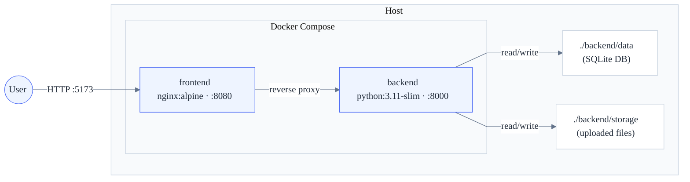

# Deployment Guide

> Docker topology, operating modes, and configuration reference.

## 1. Quick Start

**Prerequisites:** Docker Engine 20+ and Docker Compose v2.

```bash
docker compose up --build
```

Open **http://localhost:5173** — see the [User Guide](user-guide) for what to try.

Open **http://localhost:8000/docs** — interactive API reference (Swagger UI auto-generated by FastAPI).

To reset all data: `docker compose down` then delete `backend/data/` and `backend/storage/`.

## 2. Topology



<!-- Sources: docker-compose.yml, Dockerfile.backend, Dockerfile.frontend -->

| Service  | Base Image        | Host Port | Health Check            |
| -------- | ----------------- | --------- | ----------------------- |
| backend  | python:3.11-slim  | 8000      | `GET /health/ready`     |
| frontend | nginx:alpine      | 5173      | `wget http://127.0.0.1:8080/` |

Both containers run as non-root (`appuser`), include Docker health checks
(10 s interval, 8 retries), and the frontend waits for a healthy backend
before starting.

## 3. Operating Modes

### Production-like (default)

```bash
docker compose up --build
```

Deterministic image builds, static frontend via nginx, data persisted through
host-mounted volumes.

### Development

```bash
docker compose -f docker-compose.yml -f docker-compose.dev.yml up --build
```

Source bind-mounted for live reload (uvicorn `--reload`, Vite HMR). Polling
enabled for Windows/WSL2 compatibility.

### Running Tests

```bash
docker compose --profile test run --rm backend-tests    # pytest
docker compose --profile test run --rm frontend-tests   # vitest

# E2E (Playwright — requires running containers)
docker compose up -d --build
cd frontend && npx playwright test
```

## 4. Configuration

All environment variables have sensible defaults — **no configuration is
required for a standard run.**

| Variable          | Default | Purpose                              |
| ----------------- | ------- | ------------------------------------ |
| `BACKEND_PORT`    | `8000`  | Host port for the backend            |
| `FRONTEND_PORT`   | `5173`  | Host port for the frontend           |
| `LOG_LEVEL`       | `INFO`  | Python logging level                 |
| `AUTH_TOKEN`      | _(none)_| Optional bearer token; unset = open  |

Additional variables for storage paths, CORS origins, rate limits, confidence
thresholds, and build metadata are documented in
[`backend/app/settings.py`](https://github.com/isilionisilme/veterinary-medical-records-handoff/blob/main/backend/app/settings.py) with inline
defaults and descriptions.

## 5. Capacity & Constraints

The current deployment targets a **single-instance workload**. The following
limits are deliberate architectural choices, not oversights.

| Constraint              | Limit                     | Rationale                                                                                        |
| ----------------------- | ------------------------- | ------------------------------------------------------------------------------------------------ |
| Single-process model    | 1 API + 1 scheduler thread| [ADR-in-process-async-processing](ADR-in-process-async-processing) — no external task queue |
| SQLite single-writer    | ~50 concurrent writes/s   | [ADR-sqlite-database](ADR-sqlite-database) — WAL + busy_timeout mitigate              |
| No horizontal scaling   | 1 container per service   | Monolith by design; worker profile documented in ADR-0004                                        |
| Max upload size         | 20 MB per file            | Validated at API layer; configurable                                                             |
| Rate limits             | 10 uploads/min            | Via `slowapi`; configurable via env vars                                                         |

**Production path:** The modular-monolith architecture is designed so each
bounded context can migrate independently — swap SQLite for PostgreSQL, extract
the processing scheduler to Celery/RQ workers, add connection pooling and
streaming uploads. See [ADR-modular-monolith](ADR-modular-monolith)
for the full migration path.

## 6. Related Documents

| Document                                                     | Relationship                               |
| ------------------------------------------------------------ | ------------------------------------------ |
| [architecture.md](architecture)                           | System overview and tech stack             |
| [technical-design.md](technical-design)                   | Data persistence and processing rules      |
| [ADR-modular-monolith](ADR-modular-monolith)       | Why single-process monolith                |
| [ADR-in-process-async-processing](ADR-in-process-async-processing) | Why in-process scheduler (no Celery) |
