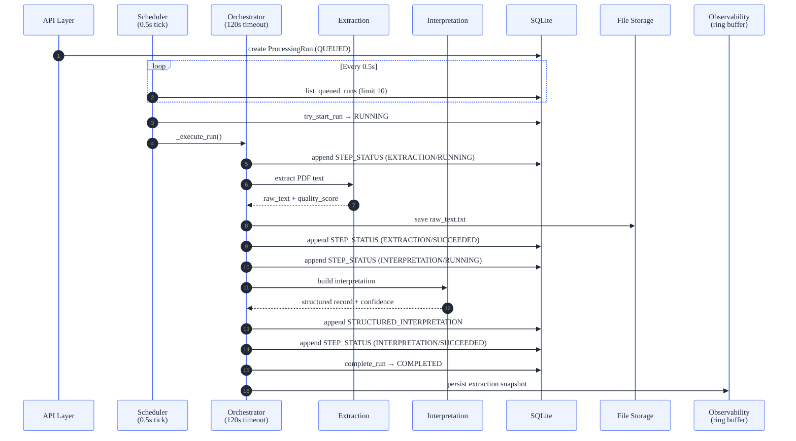
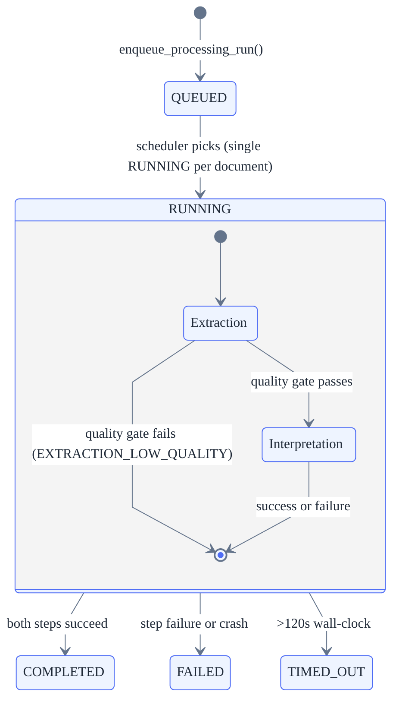
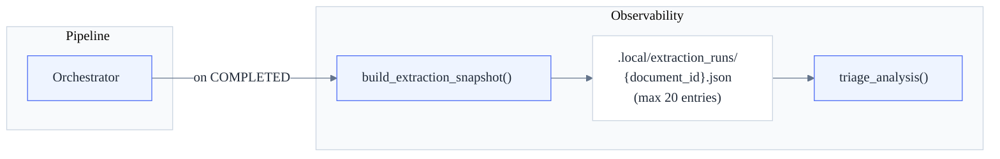
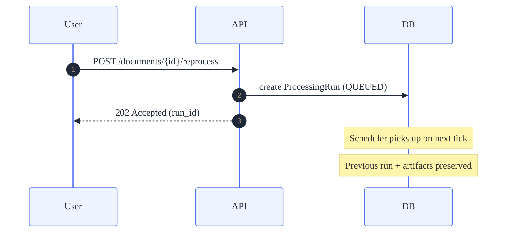

# Event & Processing Architecture

> How documents flow through the processing pipeline, what artifacts are
> persisted, and how the system tracks extraction quality over time.

## 1. Pipeline Overview

Every uploaded PDF goes through a two-step pipeline: **Extraction** (PDF → raw
text) and **Interpretation** (raw text → structured medical record). The pipeline
is orchestrated in-process via an async scheduler.



<!-- Sources: backend/app/application/processing/orchestrator.py, backend/app/application/processing/scheduler.py -->

## 2. Pipeline Steps

### 2.1 Extraction

| Aspect        | Detail                                                               |
| ------------- | -------------------------------------------------------------------- |
| Input         | PDF file from storage                                                |
| Output        | Raw text string                                                      |
| Persistence   | `raw_text.txt` in file storage                                       |
| Quality gate  | `evaluate_extracted_text_quality()` — fails with `EXTRACTION_LOW_QUALITY` if below threshold |
| Extractors    | Multiple (pypdf, pdfminer); selectable via `PDF_EXTRACTOR_FORCE`     |

### 2.2 Interpretation

| Aspect        | Detail                                                               |
| ------------- | -------------------------------------------------------------------- |
| Input         | Raw text from extraction step                                        |
| Output        | `STRUCTURED_INTERPRETATION` artifact                                 |
| Sub-steps     | Candidate mining → schema mapping → normalization → validation → confidence calibration |
| Schema        | `visit-grouped-canonical` (24 fields)                                |
| Confidence    | Per-field confidence (0–1) using policy bands (low/mid/high)         |

## 3. State Machine

Processing runs follow a strict state machine (see
[technical-design.md Appendix A1](technical-design.md#a1-state-model--source-of-truth)
for the authoritative contract).



<!-- Sources: backend/app/domain/models.py (ProcessingRunState), backend/app/application/processing/orchestrator.py -->

### Failure Types

| `failure_type`              | Cause                                    |
| --------------------------- | ---------------------------------------- |
| `EXTRACTION_FAILED`         | PDF text extraction error                |
| `EXTRACTION_LOW_QUALITY`    | Extracted text below quality threshold   |
| `INTERPRETATION_FAILED`     | Structured data interpretation error     |
| `PROCESS_TERMINATED`        | Crash recovery — orphaned RUNNING run    |

## 4. Artifact Types

All artifacts are **append-only** — once persisted, they are never modified.

| Artifact Type                | Payload                                      | Storage   | Cardinality  |
| ---------------------------- | -------------------------------------------- | --------- | ------------ |
| `STEP_STATUS`                | Step lifecycle (name, status, error_code, timestamps) | SQLite    | 2–4 per run  |
| `STRUCTURED_INTERPRETATION`  | Full structured medical record with metadata | SQLite    | 0–1 per run  |
| Raw text                     | Extracted PDF text                           | File system | 0–1 per run |

### STRUCTURED_INTERPRETATION Payload

```json
{
  "interpretation_id": "uuid",
  "version_number": 1,
  "data": {
    "document_id": "uuid",
    "processing_run_id": "uuid",
    "schema_contract": "visit-grouped-canonical",
    "fields": [
      { "key": "pet_name", "value": "Rex", "confidence": 0.92,
        "evidence": { "page": 1, "snippet": "Paciente: Rex" } }
    ],
    "global_schema": { "pet_name": ["Rex"], "species": ["Canine"] },
    "summary": {
      "total_keys": 24, "populated_keys": 18,
      "keys_present": ["..."], "warning_codes": []
    },
    "confidence_policy": {
      "policy_version": "v1.0",
      "band_cutoffs": { "low_max": 0.6, "mid_max": 0.8 }
    }
  }
}
```

## 5. Extraction Observability

Each completed run persists an extraction snapshot to a per-document ring buffer
(max 20 entries), enabling trend analysis across reprocessing cycles. The
snapshot captures per-field status, confidence bands, top candidates, and
aggregate counts.



<!-- Sources: backend/app/application/processing/extraction_observability/ -->

## 6. Reprocessing

Reprocessing creates a **new** `ProcessingRun` in `QUEUED` state. The previous run
and its artifacts are preserved (append-only history).



<!-- Sources: backend/app/application/processing/scheduler.py (enqueue_processing_run) -->

Key rules:
- If a run is already `RUNNING`, the new run stays `QUEUED` until it finishes.
- Reprocessing does **not** change the document's `review_status`.
- Each run produces independent artifacts — no overwriting.

## 7. Related Documents

| Document                                                          | Relationship                              |
| ----------------------------------------------------------------- | ----------------------------------------- |
| [technical-design.md](technical-design)                        | State contracts (Appendix A1), processing rules (§3) |
| [backend-implementation.md](backend-implementation)            | Implementation guidance for the pipeline described here |
| [architecture.md](architecture)                                | System diagram and layer overview         |
| [extraction-quality.md](extraction-quality)                    | Quality evaluation details                |
| [ADR-in-process-async-processing](ADR-in-process-async-processing)| Why in-process async (no Celery/RQ)       |
| [ADR-confidence-scoring-algorithm](ADR-confidence-scoring-algorithm)| Confidence scoring algorithm design       |
