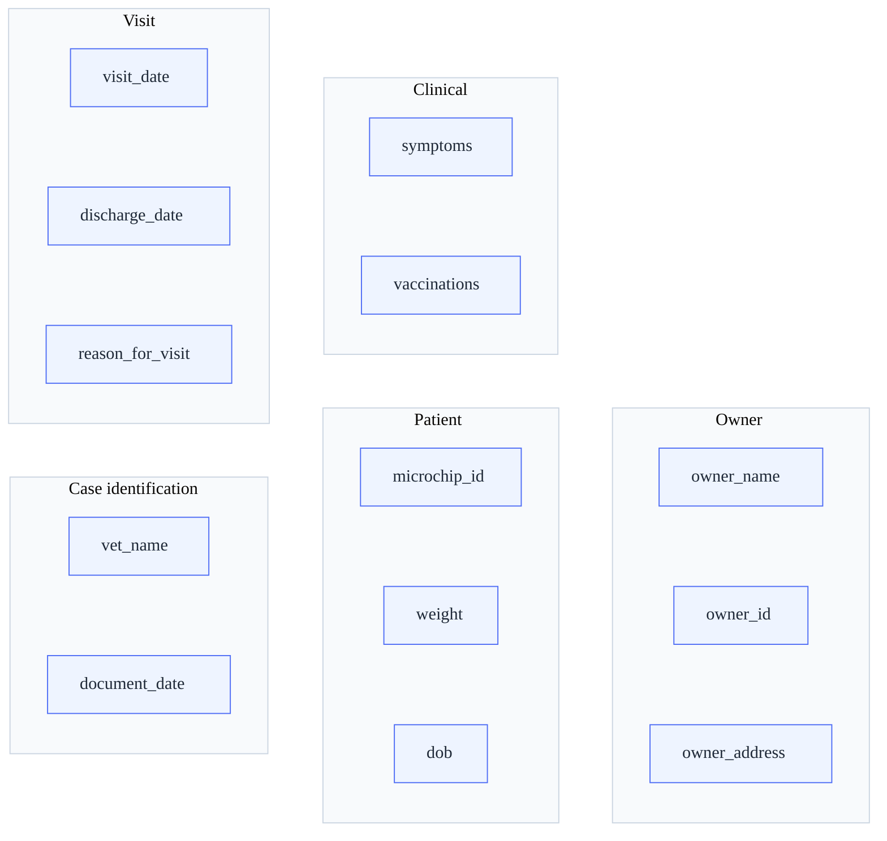

# Extraction Quality Strategy

Design rationale and per-field guardrails for the PDF extraction pipeline.
The extraction pipeline uses regex-based candidate mining with confidence scoring.

This document captures the quality rules that govern field acceptance.

> Confidence policy values (band thresholds, hysteresis, minimum volume) are
> defined in [Technical Design §4 — Confidence Contract](technical-design).
> This page applies those values to field-level guardrails; if the two diverge,
> technical-design.md prevails.

---

## 1. Design Approach

### Operating loop

1. **Observe** -- per-run snapshots persist field status (missing / rejected / accepted) with candidate evidence.
2. **Triage** -- rank issues by frequency x business impact via summary endpoint.
3. **Minimal fix** -- smallest safe change (candidate rule, validator, normalizer).
4. **Verify** -- compare before/after with extraction summary (trend window = 20 runs, latest = 1 run).

### Decision principles

- Prefer rejecting garbage over filling wrong values.
- Prioritize highest ROI fields first.
- Prioritize reject-prone fields where top-1 candidate is semantically correct.
- Keep fixes minimal; avoid broad refactors.

---

## 2. Field Guardrails

> Schema reference: canonical field list in [product-design.md](product-design) Appendix A,
> enforced at runtime by [`global_schema_contract.json`](https://github.com/isilionisilme/veterinary-medical-records-handoff/blob/main/shared/global_schema_contract.json).

### Case identification

| Field | Accept | Reject | Notes |
|-------|--------|--------|-------|
| `vet_name` | Person-like tokens with vet context (`Veterinario/a`, `Dr./Dra.`) | Clinic names, address-heavy lines | Header-block capture tuning |
| `document_date` | `DD/MM/YYYY`, `D/M/YY`, `YYYY-MM-DD` + variants. Two-digit year: 00-69 -> 20xx, 70-99 -> 19xx | Invalid calendar dates, non-date strings | -- |

### Patient

| Field | Accept | Reject | Notes |
|-------|--------|--------|-------|
| `microchip_id` | 9-15 digits (trailing text trimmed) | Owner/address text, alphanumeric non-digit IDs | OCR-hardened; chip-context or explicit prefix required |
| `weight` | Numeric 0.5-120, unit optional (`kg`), comma decimals ok. Normalizes to `X kg` | `0`, out-of-range, non-numeric | -- |
| `dob` | Valid calendar date, plausible age (0-40 years) | Future dates, > 40 years old, `visit_date` promoted as DOB | Birth-date anchor context required |

### Owner

| Field | Accept | Reject | Notes |
|-------|--------|--------|-------|
| `owner_name` | Explicit owner context or strict header fallback | Patient-labeled, vet/clinic context | Tabular + conservative fallback |
| `owner_id` | DNI/NIE-like identifiers | -- | Extraction pending |
| `owner_address` | Owner-context addresses with address tokens (`calle`, `avenida`, `plaza`, `cp`) | Clinic addresses, too short/long garbage | Owner/clinic disambiguation + multiline heuristic |

### Visit / episode

| Field | Accept | Reject | Notes |
|-------|--------|--------|-------|
| `visit_date` | Same date formats as `document_date`; visit/consult anchors required | Birthdate context | -- |
| `discharge_date` | Same date formats; strict discharge-label context only | Non-discharge dates | -- |
| `reason_for_visit` | -- | -- | Anchor coverage pending (`motivo`, `consulta`) |

### Clinical

| Field | Accept | Reject | Notes |
|-------|--------|--------|-------|
| `symptoms` | Symptom-label context + section/header-driven | Treatment/noise language | -- |
| `vaccinations` | Strict label-only extraction | Narrative/admin text | Concise list guardrails |

---

## 3. Risk Matrix (Golden Fields)

| Field | Primary risk | Active guardrail |
|-------|-------------|-----------------|
| `microchip_id` | Generic numeric IDs captured as chip | Chip-context + digits-only 9-15 |
| `owner_name` | Patient/vet names promoted | Explicit owner context required |
| `owner_address` | Clinic address promoted | Contextual disambiguation + observability flags |
| `weight` | Dosage/zero accepted | Range [0.5, 120], reject `0` |
| `vet_name` | Clinic/address promoted | Person-like normalization |
| `visit_date` | Birthdate mapped as visit | Reject birthdate context, require anchors |
| `discharge_date` | Timeline dates misclassified | Strict discharge-label only |
| `vaccinations` | Narrative captured as list | Label-only extraction |
| `symptoms` | Treatment instructions promoted | Symptom-label context only |

---

## 4. Confidence Policy

| Parameter | Value |
|-----------|-------|
| Label-driven extraction | 0.66 |
| Fallback extraction | 0.50 |
| Promotion rule | Only when canonical value missing, top-1 exists, confidence meets threshold |
| Overwrite | Never overwrite existing canonical values |

---

## 5. Observability

- Per-run extraction snapshot: per-field status (`missing` / `rejected` / `accepted`) with top-3 candidate evidence.
- Storage: ring buffer of 20 runs per document at `.local/extraction_runs/<documentId>.json`.
- Backend-canonical: snapshots auto-persisted at completed-run boundary.
- Debug endpoints: `POST /debug/extraction-runs`, `GET .../summary?limit=N`.

---

## 6. Golden Fields Status

| Field | Status | Done |
|-------|--------|:----:|
| `microchip_id` | Digits-only 9-15, OCR hardened | yes |
| `owner_name` | Tabular + conservative fallback | yes |
| `weight` | Range [0.5, 120], reject 0 | yes |
| `vet_name` | Person normalization, clinic rejection | yes |
| `visit_date` | Date normalization, birthdate rejection | yes |
| `dob` | Date normalization + birth-date anchors | yes |
| `discharge_date` | Label-only context | yes |
| `vaccinations` | Strict label-only | yes |
| `symptoms` | Label-only, treatment noise rejection | yes |
| `owner_address` | Owner/clinic disambiguation, benchmark >= 89.7% | yes |

**Pending:** `owner_id`, `reason_for_visit`, `clinical_record_number`, `coat_color`, `hair_length`, `repro_status`.