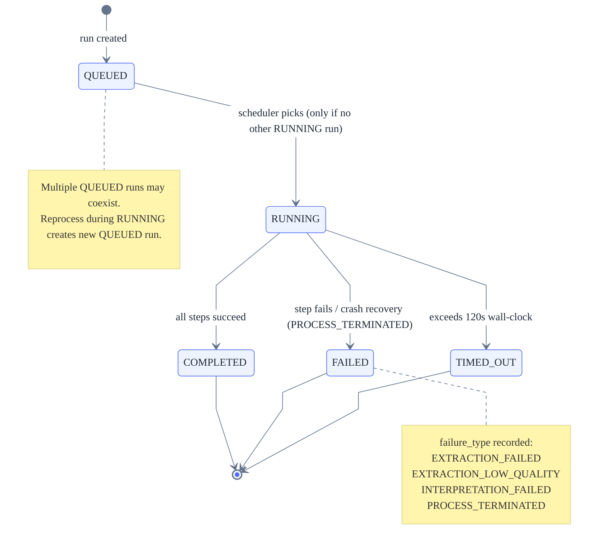
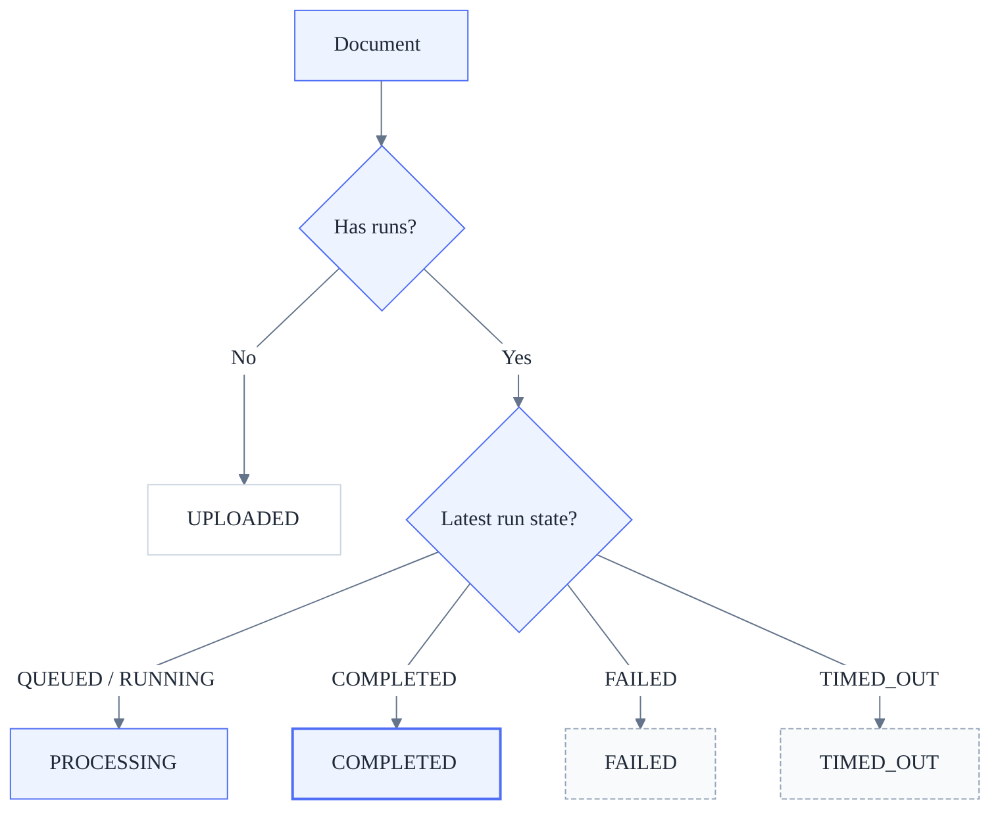
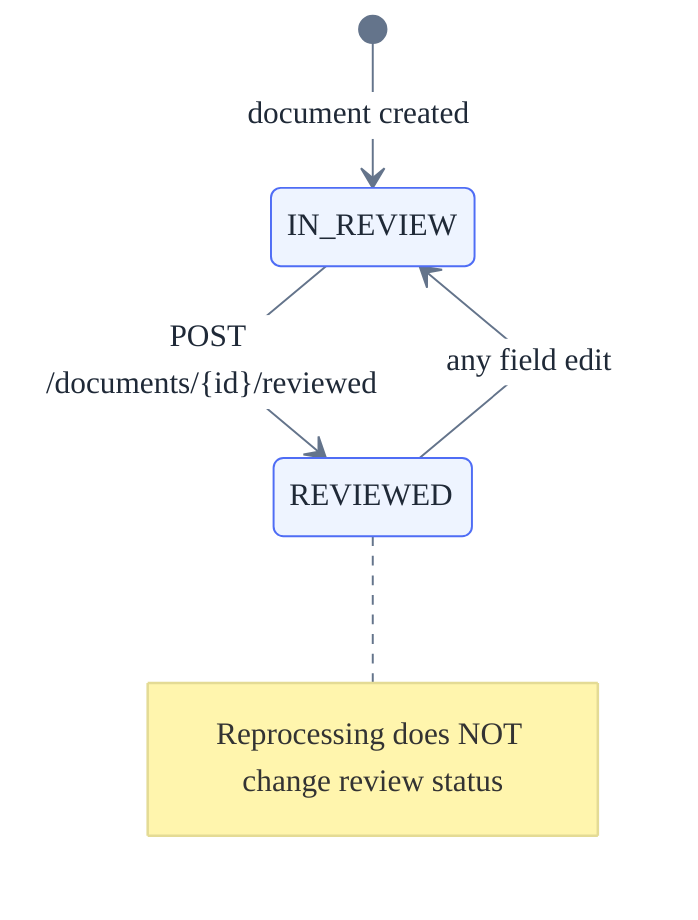
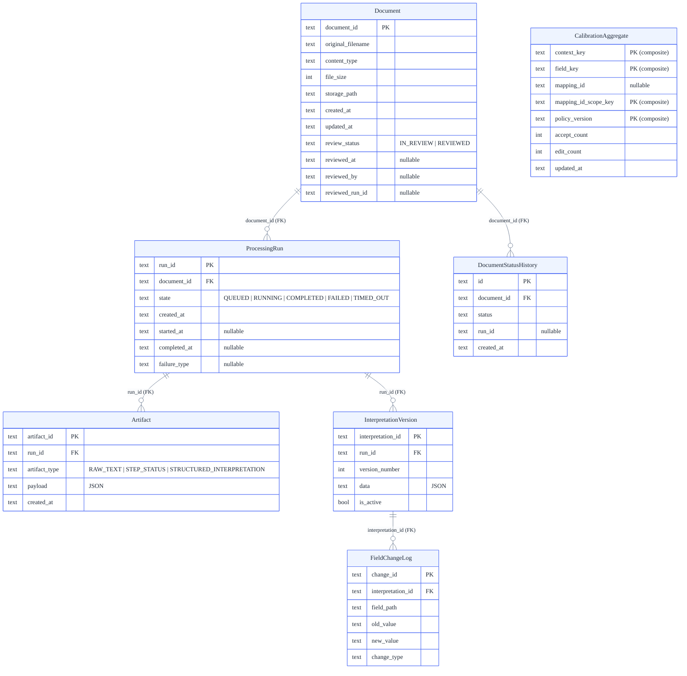

<!-- markdownlint-disable MD013 -->

# Technical Design — Appendices

**Breadcrumbs:** [Home](Home) / [Projects](Sitemap) / veterinary-medical-records / 02-tech

These appendices contain the normative contracts, state models, API maps, schema definitions,
and operational rules referenced by [technical-design.md](technical-design).

---

# Appendix A — Contracts, States & Invariants (Normative)

> **Scope:** system-wide authoritative rules — state model, invariants, concurrency, and governance.
> If any conflict exists between this appendix and other documents (User Stories, Implementation Plan, examples), **this
> appendix takes precedence**.

Its purpose is to remove ambiguity for implementation (human or AI-assisted) and to prevent divergent interpretations.

---

## A1. State Model & Source of Truth

### A1.1 Processing Run State (authoritative)

Each `ProcessingRun` has exactly one state at any time:

- `QUEUED`
- `RUNNING`
- `COMPLETED`
- `FAILED`
- `TIMED_OUT`



<!-- Sources: backend/app/domain/models.py (ProcessingRunState enum), backend/app/application/processing/orchestrator.py (transitions), backend/app/domain/status.py (failure types) -->

#### Rules

- States are **append-only transitions** (no rollback).
- Only one run may be `RUNNING` per document.
- Runs are immutable once terminal (`COMPLETED`, `FAILED`, `TIMED_OUT`).

---

### A1.2 Document Status (derived, not stored)

`Document.status` is **derived**, never manually set.

Derivation rules:

| Condition                           | Document Status |
| ----------------------------------- | --------------- |
| No processing run exists            | `UPLOADED`      |
| Latest run is `QUEUED` or `RUNNING` | `PROCESSING`    |
| Latest run is `COMPLETED`           | `COMPLETED`     |
| Latest run is `FAILED`              | `FAILED`        |
| Latest run is `TIMED_OUT`           | `TIMED_OUT`     |



#### Rule

- Document status always reflects the **latest run**, not the latest completed run.

---

### A1.3 Review Status (human workflow only)

Review status is **independent** from processing.

Allowed values:

- `IN_REVIEW` (default)
- `REVIEWED`



#### Rules

- Stored at document level.
- Editing structured data automatically reverts `REVIEWED → IN_REVIEW`.
- Reprocessing does **not** change review status.
- Review status never blocks processing, editing, or governance.

---

### A1.4 Source of Truth Summary

| Concept             | Source of Truth            |
| ------------------- | -------------------------- |
| Processing progress | `ProcessingRun.state`      |
| Document lifecycle  | Derived from runs          |
| Human workflow      | `ReviewStatus`             |
| Interpretation data | Versioned interpretations  |
| Governance          | Governance candidates/logs |

---

## A2. Processing Run Invariants

- Every processing attempt creates **exactly one** `ProcessingRun`.
- Runs are **append-only** and never overwritten.
- Artifacts (raw text, interpretations, confidence) are **run-scoped**.
- Reprocessing:
  - creates a new run,
  - never mutates previous runs or artifacts,
  - may remain `QUEUED` if another run is `RUNNING`.

---

## A3. Interpretation & Versioning Invariants

### A3.1 Structured Interpretations

- Interpretations are versioned records linked to a run.
- Any edit creates a **new interpretation version**.
- Previous versions are retained and immutable.
- Exactly one interpretation version is **active** at a time per run.

#### Active version invariant (Operational, normative)

- When creating a new InterpretationVersion for a run:
  - It MUST be done in a single transaction:
    1. set all previous versions for that `run_id` to `is_active = false`
    2. insert the new version with `is_active = true` and `version_number = previous_max + 1`
- At no point may two rows be active for the same `run_id`.

---

### A3.2 Field-Level Changes

- All edits produce field-level change log entries.
- Change logs are append-only.
- Structural changes (add/remove/rename field):
  - set internal `pending_review = true`,
  - do **not** affect veterinarian workflow.

---

## A4. Confidence Rules

- Confidence is:
  - contextual,
  - conservative,
  - explainable.
- Confidence:
  - guides attention,
  - never blocks actions,
  - never implies correctness.
- Confidence updates:
  - are local,
  - are non-immediate,
  - never trigger automation.

---

## A5. API Contract Principles

These principles apply to **all endpoints**:

- APIs are **internal**.
- Contracts are explicit and deterministic.
- Responses always include enough context for the UI to explain:
  - current state,
  - latest run,
  - failure category (if any).
- No endpoint:
  - triggers implicit schema changes,
  - blocks veterinarian workflows.

### A5.1 Run Resolution Rule

- UI obtains `run_id` via document endpoints.
- “Latest completed run” is used for review.
- “Latest run” is used for status and processing visibility.

---

## A6. Concurrency & Idempotency Rules

- At most one `RUNNING` run per document is allowed (multiple `QUEUED` runs may exist).
- Guards must exist at persistence level (transactional or equivalent).
- Repeated user actions (upload, reprocess, mark reviewed):
  - must be safe to retry,
  - must not create inconsistent state.

---

## A7. Governance Invariants

- Governance operates **only at schema level**.
- Governance decisions:
  - never modify existing documents,
  - never trigger reprocessing implicitly,
  - apply prospectively only.
- All governance decisions are:
  - append-only,
  - auditable,
  - reviewer-facing only.

---

## A8. Audit & Observability Rules

- All critical actions emit structured logs.
- Logs:
  - include relevant identifiers (`document_id`, `run_id`, `candidate_id`),
  - are best-effort,
  - never block user flows.
- Audit trails (governance):
  - are immutable,
  - read-only,
  - stored separately from document data.

### A8.1 Event Type Taxonomy (Authoritative)

`event_type` must be one of the following values.

Run-level:

- `RUN_CREATED`
- `RUN_STARTED`
- `RUN_COMPLETED`
- `RUN_FAILED`
- `RUN_TIMED_OUT`
- `RUN_RECOVERED_AS_FAILED` (startup recovery of orphaned RUNNING runs)

Step-level:

- `STEP_STARTED`
- `STEP_SUCCEEDED`
- `STEP_FAILED`
- `STEP_RETRIED`

User actions:

- `DOCUMENT_UPLOADED`
- `REPROCESS_REQUESTED`
- `DOCUMENT_LANGUAGE_OVERRIDDEN`
- `MARK_REVIEWED`
- `INTERPRETATION_EDITED`

Reviewer actions:

- `GOVERNANCE_DECISION_RECORDED`
- `SCHEMA_CONTRACT_CREATED`

Rules:

- Structured logs remain best-effort and never block processing.
- Each log entry must include:
  - `document_id`
  - `run_id` (nullable only when not yet created)
  - `step_name` (nullable)
  - `event_type`
  - `timestamp`
  - `error_code` (nullable)

---

## A10. Final Rule

If a future feature, story, or implementation choice conflicts with any rule in this appendix:

**STOP.  
Clarify the conflict.  
Do not guess or infer behavior.**

This appendix is the final authority.

---

---

# Appendix B — Operational Clarifications (Normative)

> **Scope:** processing model (B1), persistent data model (B2), API endpoint map (B3), idempotency (B4), filesystem rules (B5), blocking rules (B6), testability (B7).

This appendix adds **explicit operational and implementation-level clarifications** to the Technical Design Document.  
It does **not** introduce new features, infrastructure, or behavior.  
It exists solely to remove ambiguity and prevent implicit decisions during implementation.

If any conflict exists between this appendix and other documents,
**[Appendix A](#appendix-a--contracts-states--invariants-normative) and this appendix take precedence**.

---

## B1. Asynchronous In-Process Processing Model (Authoritative)

### B1.1 Assumed Execution Model

Background processing is executed **in-process**, using a controlled background task runner (e.g. internal task loop or
executor).

If future user stories introduce multi-instance execution or external workers/queues, they must define the additional
coordination contracts explicitly.

This choice prioritizes simplicity and debuggability over throughput.

---

### B1.2 Single `RUNNING` Run Guarantee

Definitions:

- A **running run** is a `ProcessingRun` in state `RUNNING`.

Rules:

- At most **one `RUNNING` run per document** is allowed.
- This invariant is enforced at the **persistence layer**, not in memory.
- Any attempt to create a new run when a `RUNNING` run exists must:
  - be accepted as a new run in `QUEUED` (append-only),
  - and will only start once no other run is `RUNNING` for that document.

No background worker may start a run without verifying this invariant.

---

### B1.2.1 Persistence-Level Guard Pattern (SQLite, Authoritative)

To enforce “at most one `RUNNING` run per document”, run creation and run start transitions must follow a
persistence-level guard pattern that prevents race conditions.

Definitions:

- A running run is a run with state `RUNNING`.

Pattern (normative):

- Create or start a run only under a write-locking transaction (e.g., `BEGIN IMMEDIATE` in SQLite).
- Under the same transaction scope:
  1. Query whether a `RUNNING` run exists for the target `document_id`.
  2. Apply the rules below.

Rules:

- Creating a run:
  - Always allowed to insert a new run in `QUEUED` (append-only history).
- Starting a run (`QUEUED → RUNNING`):
  - Allowed only if **no other run is `RUNNING`** for that `document_id` (multiple `QUEUED` runs may exist).
  - The check and the state transition must happen under the same lock/transaction scope.

No worker may transition a run to `RUNNING` without verifying these invariants at persistence level.

---

### B1.3 Crash & Restart Semantics

On application startup:

- Any run found in state `RUNNING` is considered **orphaned**.
- Orphaned runs must be transitioned to `FAILED` with `failure_type = PROCESS_TERMINATED`.

Rationale:

- Avoids “stuck” runs.
- Keeps the state machine monotonic and explainable.

---

### B1.4 Retry & Timeout Policy

- Retries:
  - Are local to a single run.
  - Are limited to a small, fixed number (e.g. 1–2 retries).
  - Do not create new runs.
- Timeouts:
  - A run exceeding a fixed execution window transitions to `TIMED_OUT`.
  - `TIMED_OUT` is a terminal state.

Reprocessing always creates a **new run**.

### B1.4.1 Fixed defaults (Normative)

- Step retry limit: 2 attempts total (1 initial + 1 retry).
- Run timeout: 120 seconds wall-clock from `RUN_STARTED`.

---

### B1.5 In-Process Scheduler Semantics (Authoritative)

The system includes an in-process scheduler that periodically attempts to start queued runs.

Rules:

- Selection:
  - For each document, the scheduler must prefer the **oldest** `QUEUED` run (by creation time).
- Start condition:
  - A `QUEUED` run may start only if no run is `RUNNING` for that document.
- Transition:
  - The scheduler must apply the persistence guard pattern
    ([B1.2.1](#b121-persistence-level-guard-pattern-sqlite-authoritative)) when transitioning `QUEUED → RUNNING`.
- Best-effort:
  - Scheduler execution is best-effort and must not block API requests.
  - Crash/restart relies on [B1.3](#b13-crash--restart-semantics) (startup recovery) and future scheduler cycles.

---

### B1.5.1 Scheduler tick & fairness (Normative)

- The scheduler runs on a fixed tick (every 0.5 s).
- On each tick, it attempts to start runs in FIFO order by `created_at`.
- It MUST NOT busy-loop; it sleeps between ticks.
- If a start attempt fails due to transient DB lock/contention, it logs `STEP_RETRIED` (or a dedicated scheduler event)
  and retries on the next tick.

## B2. Minimal Persistent Data Model (Textual ERD)

This section defines the **minimum required persistent entities** and invariants. It is **not** a SQL schema, but an
authoritative structural contract.



This ERD shows the 7 persistent entities: 5 operational core entities (Document, ProcessingRun, Artifact, InterpretationVersion, FieldChangeLog) plus DocumentStatusHistory (audit trail) and CalibrationAggregate (confidence calibration). Column types reflect the SQLite implementation (`text` for UUIDs and timestamps, `int` for counters). See `backend/app/infra/database.py` for the authoritative SQL schema.

---

### B2.1 Document

**Purpose**: Represents an uploaded document.

Key fields:

- `document_id` (PK)
- `original_filename`
- `content_type`
- `file_size`
- `storage_path`
- `created_at`

Stored workflow fields:

- `review_status` (`IN_REVIEW | REVIEWED`)
- `language_override` (nullable; see B3.1 “Language override endpoint”)

Derived / external:

- `status` (derived; see [Appendix A](#a12-document-status-derived-not-stored))

Invariants:

- A document must exist before any run.
- A document is never deleted.

---

### B2.2 ProcessingRun

**Purpose**: Represents one processing attempt.

Key fields:

- `run_id` (PK)
- `document_id` (FK)
- `state`
- `started_at`
- `completed_at`
- `failure_type` (nullable)
- `language_used`
- `schema_contract_used`

Invariants:

- Append-only.
- At most one `RUNNING` run per document (multiple `QUEUED` runs may exist).
- Terminal states are immutable.

---

### B2.3 Artifacts

**Purpose**: Stores run-scoped outputs (raw text, metadata).

Key fields:

- `artifact_id`
- `run_id` (FK)
- `artifact_type`
- `payload` (JSON or FS reference)
- `created_at`

Invariants:

- Artifacts are immutable.
- Artifacts are always linked to exactly one run.

#### ArtifactType (Closed Set, normative)

- `RAW_TEXT` (filesystem reference)
- `STEP_STATUS` (JSON payload; [Appendix C](#appendix-c--step-model--run-execution-semantics-normative))

---

### B2.4 InterpretationVersion

**Purpose**: Versioned structured interpretation.

Key fields:

- `interpretation_id`
- `run_id` (FK)
- `version_number`
- `data` (JSON)
- `created_at`
- `is_active`

Invariants:

- Append-only.
- Exactly one active version per run.

---

### B2.5 FieldChangeLog

**Purpose**: Captures human edits.

Key fields:

- `change_id`
- `interpretation_id`
- `field_path`
- `old_value`
- `new_value`
- `change_type`
- `created_at`

Invariants:

- Append-only.
- Never blocks veterinarian workflow.

---

#### B2.5.1 Field path format (Authoritative)

`field_path` MUST be stable across versions and MUST NOT rely on array indices.

Format (normative):

- `field_path = "fields.{field_id}.value"`

Notes:

- `field_id` refers to `StructuredField.field_id` in [Appendix D](#d5-structuredfield-authoritative).
- This allows a reviewer to trace changes even if the `fields[]` order changes between versions.

---

### B2.6 API Error Response Format & Naming Authority (Normative)

### API Error Response Format (Normative)

All API errors MUST return a JSON body with a stable, machine-readable structure:

```json
{
  "error_code": "STRING_ENUM",
  "message": "Human-readable explanation",
  "details": { "optional": "object" }
}
```

Rules:

- `error_code` is stable and suitable for frontend branching.
- `message` is safe for user display (no stack traces).
- `details` is optional and must not expose filesystem paths or secrets.

---

### API Naming Authority (Normative)

The authoritative endpoint map is defined in **[Appendix B3](#b3-minimal-api-endpoint-map-authoritative) (+
[B3.1](#b31-run-resolution-per-endpoint-authoritative))**.

If any user story lists different endpoint paths, treat them as non-normative examples and implement the authoritative
map.

---

### B2.7 SchemaVersion (Authoritative)

**Purpose**: Stores canonical schema contract snapshots used by new processing runs.

Key fields:

- `schema_contract_id` (PK)
- `version_number` (monotonic integer)
- `schema_definition` (JSON)
- `created_at`
- `created_by` (reviewer identity)
- `change_summary` (nullable)

Invariants:

- Append-only; schema contract snapshots are immutable.
- “Current schema” is resolved as the schema contract snapshot with the highest `version_number`.
- New processing runs MUST persist `schema_contract_used` resolved at run creation time ([B2.2](#b22-processingrun)).

---

### B2.8 StructuralChangeCandidate (Authoritative)

**Purpose**: Represents an aggregated, reviewer-facing candidate for schema evolution derived from repeated
document-level edit patterns.

Key fields:

- `candidate_id` (PK)
- `change_type` (closed set; e.g. `NEW_KEY | KEY_RENAME | KEY_DEPRECATION | KEY_MAPPING`)
- `source_key` (nullable)
- `target_key`
- `occurrence_count`
- `status` (`PENDING | APPROVED | REJECTED | DEFERRED`)
- `created_at`
- `updated_at`
- `evidence_samples` (JSON; small, representative samples: page + snippet + optional document reference)

Invariants:

- Candidates are reviewer-facing only.
- Candidate details are never exposed in veterinarian workflows.
- Status changes MUST be traceable via append-only `GovernanceDecision` ([B2.9](#b29-governancedecision-authoritative)).
- Candidate decisions apply prospectively only ([A7](#a7-governance-invariants)).

---

### B2.9 GovernanceDecision (Authoritative)

**Purpose**: Append-only audit log of reviewer governance actions (schema evolution decisions).

Key fields:

- `decision_id` (PK)
- `candidate_id` (nullable)
- `decision_type` (closed set; `APPROVE | REJECT | DEFER | FLAG_CRITICAL`)
- `previous_status` (nullable)
- `new_status` (nullable)
- `schema_contract_id` (nullable; present when approval creates a new schema contract snapshot)
- `reviewer_id`
- `reason` (nullable)
- `created_at`

Invariants:

- Append-only and immutable.
- Stored separately from document-level data ([A8](#a8-audit--observability-rules)).
- Reviewer actions never modify existing documents or trigger implicit reprocessing ([A7](#a7-governance-invariants)).

---

## B3. Minimal API Endpoint Map (Authoritative)

This section defines the **minimum endpoint surface**.

---

### Document-Level

- `POST /documents/upload`
  - Upload a document (PDF only in the current implementation).
- `GET /documents`
  - List documents with derived status.
- `GET /documents/{id}`
  - Document metadata + latest run info.
- `GET /documents/{id}/download`
  - Download (and when supported, preview) the original uploaded file.
- `POST /documents/{id}/reprocess`
  - Create new processing run.
- `POST /documents/{id}/reviewed`
  - Mark as reviewed.
- `PATCH /documents/{id}/language`
  - Set or clear a document-level language override (affects subsequent runs only).
- `GET /documents/{id}/processing-history`
  - Read-only processing history (runs + step statuses).

### Supported upload types (Normative)

The system MUST accept only PDF uploads in the current implementation:

- `.pdf`
- `application/pdf`

Rules:

- Any other content type MUST return:
  - HTTP 415
  - `error_code = UNSUPPORTED_MEDIA_TYPE`
- MIME type detection MUST be based on server-side inspection, not only filename.

---

### Run / Review

- `GET /documents/{id}/review`
  - Returns:
    - latest completed run,
    - active interpretation,
    - confidence and evidence.
- `GET /runs/{run_id}/artifacts/raw-text`
  - Retrieve extracted text.
- `POST /runs/{run_id}/interpretations`
  - Apply veterinarian edits by creating a new interpretation version (append-only).

Rules:

- Status views use **latest run**.
- Review views use **latest completed run**.

---

### Reviewer / Governance (Reviewer-facing only)

- `GET /reviewer/structural-changes`
  - List pending structural change candidates.
- `POST /reviewer/structural-changes/{candidate_id}/decision`
  - Record a governance decision (approve/reject/defer).
- `GET /reviewer/schema/current`
  - Retrieve the current canonical schema contract snapshot.
- `GET /reviewer/governance/audit-trail`
  - Retrieve append-only governance decision history.

---

### B3.1 Run Resolution per Endpoint (Authoritative)

- `GET /documents` Returns each document with:
  - derived `document_status` (from latest run; [A1.2](#a12-document-status-derived-not-stored)),
  - `latest_run_id`, `latest_run_state` (nullable if none exists),
  - `latest_run_failure_type` (nullable),
  - `latest_run_language_used` (nullable),
  - `latest_run_schema_contract_used` (nullable).

- `GET /documents/{id}` Returns:
  - document metadata,
  - derived `document_status`,
  - `latest_run` summary (id, state, timestamps, failure_type, language_used, schema_contract_used).
  - `language_override` (nullable).

- `GET /documents/{id}/review` Resolves **latest completed run**:
  - if none exists, return an explicit error (e.g., 409) with reason `NO_COMPLETED_RUN`.

Rationale (authoritative):

- `/documents/{id}/review` is a derived “review view” that requires a completed run; if none exists yet, this is a
  **state conflict**, not a missing resource.

  Returns:
  - `latest_completed_run_id`,
  - active interpretation for that run,
  - confidence + evidence.

Rule:

- Status views always use **latest run**.
- Review views always use **latest completed run**.

#### Response shape (minimum, normative)

`GET /documents/{id}/review` returns:

- `document_id`
- `latest_completed_run`: { `run_id`, `state`, `completed_at`, `failure_type` }
- `active_interpretation`: { `interpretation_id`, `version_number`, `data` }
- `raw_text_artifact`: { `run_id`, `available`: boolean } (do not inline raw text here)

#### Field Candidate Suggestions (standard review payload)

- Contract location:
  - Candidate suggestions are included inside `active_interpretation.data.fields[]` entries in the standard review
    payload.
  - The field is optional for backward compatibility.

- Field-level shape (normative):
  - Each `StructuredField` MAY include `candidate_suggestions`.
  - `candidate_suggestions` is an array with max length `5`.
  - Items are ordered by `confidence` descending; tie-breaking MUST be deterministic.
  - Candidate item shape:
    - `value` (string)
    - `confidence` (number in `[0,1]`)
    - `evidence` (optional object)
      - `page` (optional integer)
      - `snippet` (optional string)

- Behavior:
  - `candidate_suggestions` is part of the standard payload and is not debug-only.
  - Clients MAY ignore `candidate_suggestions`.
  - If no candidates exist for a field, `candidate_suggestions` SHOULD be omitted.

- Constraints:
  - This extension does not change confidence composition or semantics.
  - This extension does not require frontend-side confidence computation changes.

---

### Processing history endpoint (minimum, normative)

`GET /documents/{id}/processing-history` returns:

- `document_id`
- `runs[]` ordered by `created_at` ascending (chronological)
  - `run_id`
  - `state`
  - `failure_type` (nullable)
  - `started_at` (nullable)
  - `completed_at` (nullable)
  - `steps[]` (derived from STEP_STATUS artifacts;
    [Appendix C](#appendix-c--step-model--run-execution-semantics-normative))
    - `step_name`
    - `step_status`
    - `attempt`
    - `started_at` (nullable)
    - `ended_at` (nullable)
    - `error_code` (nullable)

Rules:

- Read-only; does not introduce actions.
- Uses persisted artifacts as the source of truth ([C4](#c4-relationship-between-step-artifacts-and-logs-normative)).

---

### Language override endpoint (minimum, normative)

`PATCH /documents/{id}/language`:

- Request body:
  - `language_override` (string ISO 639-1 like `"en"`, or `null` to clear)
- Response body includes:
  - `document_id`
  - `language_override` (nullable)

Rules:

- Does not trigger processing or reprocessing.
- Affects only **new** runs created after the override is set.
- Must not block review or editing workflows.

---

### Interpretation edit endpoint (minimum, normative)

`POST /runs/{run_id}/interpretations` creates a new, active interpretation version for the run (append-only).

Request body (minimum):

- `base_version_number` (integer; must match the currently active version number)
- `changes[]`
  - `op` (`ADD | UPDATE | DELETE`)
  - `field_id` (uuid; required for `UPDATE | DELETE`)
  - `key` (string; required for `ADD`)
  - `value` (string|number|boolean|null; required for `ADD | UPDATE`)
  - `value_type` (string; required for `ADD | UPDATE`)

Response body (minimum):

- `run_id`
- `interpretation_id`
- `version_number` (new active version number)
- `data` (Structured Interpretation Schema visit-grouped canonical contract;
  [Appendix D](#appendix-d--structured-interpretation-schema-canonical-normative))

Rules:

- Human edits MUST produce `origin = "human"` fields ([Appendix D](#d5-structuredfield-authoritative)) and append
  `FieldChangeLog` entries ([B2.5](#b25-fieldchangelog)).
- This endpoint never mutates existing interpretation versions ([A3](#a3-interpretation--versioning-invariants)).

---

### Reviewer governance endpoints (minimum, normative)

`GET /reviewer/structural-changes` returns:

- `items[]`
  - `candidate_id`
  - `change_type`
  - `source_key` (nullable)
  - `target_key`
  - `occurrence_count`
  - `status`
  - `evidence_samples` (JSON; page + snippet + optional document reference)
  - `created_at`
  - `updated_at`

`POST /reviewer/structural-changes/{candidate_id}/decision`:

- Request body (minimum):
  - `decision_type` (`APPROVE | REJECT | DEFER | FLAG_CRITICAL`)
  - `reason` (nullable)
- Response body (minimum):
  - `decision_id`
  - `candidate_id` (nullable)
  - `decision_type`
  - `schema_contract_id` (nullable)
  - `created_at`

`GET /reviewer/schema/current` returns:

- `schema_contract_id`
- `version_number`
- `created_at`
- `change_summary` (nullable)

`GET /reviewer/governance/audit-trail` returns:

- `items[]` ordered by `created_at` ascending
  - `decision_id`
  - `candidate_id` (nullable)
  - `decision_type`
  - `schema_contract_id` (nullable)
  - `reviewer_id`
  - `reason` (nullable)
  - `created_at`

---

## B3.2 Endpoint error semantics & error codes (Normative)

This section defines **stable HTTP semantics** and `error_code` values. It prevents user stories from redefining
per-endpoint behavior.

### Error response format (Authoritative)

All error responses MUST follow Appendix **B2.6**:

- `error_code` (stable enum for frontend branching)
- `message` (safe for user display)
- `details` (optional object; must not expose secrets or filesystem paths)

### Common HTTP statuses

- `400 Bad Request`
  - Invalid request body, missing required fields, invalid parameters.
  - `error_code`: `INVALID_REQUEST`

- `404 Not Found`
  - Document or run does not exist.
  - `error_code`: `NOT_FOUND`

- `409 Conflict`
  - Request is valid, but cannot be fulfilled due to current state.
  - Examples:
    - Review requested but no completed run exists.
    - Attempt to edit when blocked by a `RUNNING` run (if applicable).
  - `error_code`: `CONFLICT`, plus a specific reason in `details.reason`.
  - Specific reasons (closed set):
    - `NO_COMPLETED_RUN`
    - `REVIEW_BLOCKED_BY_ACTIVE_RUN`
    - `RAW_TEXT_NOT_READY`
    - `RAW_TEXT_NOT_AVAILABLE`
    - `STALE_INTERPRETATION_VERSION`

- `410 Gone`
  - Persistent reference exists, but the underlying filesystem artifact is missing.
  - Applies to file downloads and raw text retrieval when stored in filesystem.
  - `error_code`: `ARTIFACT_MISSING`

- `413 Payload Too Large`
  - Upload exceeds size limit.
  - `error_code`: `FILE_TOO_LARGE`

- `415 Unsupported Media Type`
  - Unsupported upload type.
  - `error_code`: `UNSUPPORTED_MEDIA_TYPE`

- `500 Internal Server Error`
  - Unhandled exception or unexpected system failure.
  - `error_code`: `INTERNAL_ERROR`

### Notes

- Frontend MUST branch on `error_code` (and optional `details.reason`) only.
- User stories may list example error cases, but must not redefine these semantics.
- Upload type support is defined in Appendix B3 (“Supported upload types (Normative)”).

### Upload size limit (Normative)

- Maximum upload size: 20 MB (default).
- Exceeding the limit returns:
  - HTTP 413
  - `error_code = FILE_TOO_LARGE`

### GET /runs/{run_id}/artifacts/raw-text (Normative)

Returns:

- `run_id`
- `artifact_type = RAW_TEXT`
- `content_type = text/plain`
- `text` (string)

Errors:

- 404 NOT_FOUND if run does not exist
- 409 CONFLICT with `details.reason = RAW_TEXT_NOT_READY` if run exists but extraction artifact is not produced yet
- 409 CONFLICT with `details.reason = RAW_TEXT_NOT_AVAILABLE` if extraction failed or no raw-text artifact exists for
  the run
- 410 ARTIFACT_MISSING if the artifact reference exists but filesystem content is missing

### POST /runs/{run_id}/interpretations (Normative)

Errors (minimum):

- 404 NOT_FOUND if run does not exist
- 409 CONFLICT with `details.reason = REVIEW_BLOCKED_BY_ACTIVE_RUN` if the run is currently `RUNNING`
- 409 CONFLICT with `details.reason = STALE_INTERPRETATION_VERSION` if the client’s base version is not the active
  version

---

## B4. Idempotency & Safe Retry Rules (Authoritative)

The following actions must be safe to retry:

- Upload
- Reprocess
- Mark reviewed

Mechanisms:

- Persistence-level guards (see B1.2.1).
- Explicit checks for invariants (single `RUNNING` run rule + run-start guard).
- No reliance on client-provided idempotency keys.

“Safe to retry” means:

- Retrying does not corrupt state.
- Retrying may create additional append-only records (where specified), but must never produce inconsistent state.

### B4.1 Endpoint Semantics

#### POST /documents/upload

- Retrying may create a new document (no deduplication).
- The system must avoid partial persistence:
  - no DB row without filesystem artifact on success,
  - no filesystem artifact without DB row on success.

#### POST /documents/{id}/reprocess

- Always creates a new `ProcessingRun` in `QUEUED`.
- Retrying may create multiple queued runs. This is acceptable.
- The system must remain consistent:
  - runs are append-only,
  - only one run may be `RUNNING` per document at any time.

#### POST /documents/{id}/reviewed

- Idempotent:
  - if already `REVIEWED`, return success without change,
  - if `IN_REVIEW`, set to `REVIEWED`.

Non-negotiable invariant:

- The system must never end up with two runs `RUNNING` for the same document, regardless of retries.

---

## B5. Filesystem Management Rules

- Files are stored under deterministic paths:
  - `/storage/{document_id}/original.pdf`

Note:

- Additional extensions may be introduced when non-PDF upload types are supported.

- Writes must be atomic.
- DB persistence must complete **before** returning success.
- Temporary files must be cleaned up on failure.

Inconsistencies:

- FS exists, DB missing → treat as invalid artifact.
- DB exists, FS missing → surface explicit error on access.

No background cleanup is required.

---

## B6. Blocking Rules (Normative)

The following **never block veterinarians**:

- Pending review
- Low confidence
- Failed processing
- Schema governance

Only explicit user actions change review state.

---

## B7. Testability Expectations

Expected test layers:

- Unit tests:
  - state transitions,
  - derivation rules,
  - idempotency guards.
- Integration tests:
  - upload → process → review path,
  - reprocessing behavior,
  - crash recovery behavior.

---

## Final Rule

If an implementation decision is not explicitly covered by:

- the main Technical Design,
- [Appendix A](#appendix-a--contracts-states--invariants-normative),
- or this appendix,

**STOP and clarify before implementing.**

No implicit behavior is allowed.

---

# Appendix C — Step Model & Run Execution Semantics (Normative)

> **Scope:** step names (C1), run state derivation (C2), error codes (C3), step/log relationship (C4).

This appendix makes the “step-based pipeline” explicit without adding infrastructure or new required entities. It uses
run-scoped artifacts ([B2.3](#b23-artifacts)) to track step lifecycle.

If any conflict exists, [Appendix A](#appendix-a--contracts-states--invariants-normative),
[Appendix B](#appendix-b--operational-clarifications-normative), and this appendix take precedence.

---

## C1. Processing Step Model (Authoritative)

A `ProcessingRun` is executed as a sequence of steps. Step state is tracked as **run-scoped artifacts**:

- `artifact_type = STEP_STATUS`
- `payload` is JSON (schema below)

### C1.1 StepName (Closed Set)

- `EXTRACTION`
- `INTERPRETATION`

### C1.2 StepStatus (Closed Set)

- `NOT_STARTED`
- `RUNNING`
- `SUCCEEDED`
- `FAILED`

### C1.3 Step Artifact Payload (JSON)

Must include:

- `step_name` (StepName)
- `step_status` (StepStatus)
- `attempt` (integer, starts at 1)
- `started_at` (nullable)
- `ended_at` (nullable)
- `error_code` (nullable)
- `details` (nullable; small JSON)

### C1.4 Append-Only Rule

- Step changes are append-only: each update is a new artifact record.
- The “current step status” is derived from the latest `STEP_STATUS` artifact for that `step_name`.

---

## C2. Run State Derivation from Steps (Authoritative)

Rules:

- A run is `RUNNING` if any required step is `RUNNING`.
- A run is `FAILED` if any required step ends `FAILED`.
- A run is `COMPLETED` only if all required steps end `SUCCEEDED`.
- Timeouts transition the run to `TIMED_OUT` (terminal) regardless of step statuses.

---

## C3. Error Codes and Failure Mapping (Authoritative)

- `error_code` is step-level and recorded in the step artifact.
- `failure_type` is run-level and recorded on the run.

Mapping:

- Step `EXTRACTION` failure → run `failure_type = EXTRACTION_FAILED`
- Step `INTERPRETATION` failure → run `failure_type = INTERPRETATION_FAILED`
- Startup recovery orphaned `RUNNING` → run terminal failure with reason `PROCESS_TERMINATED`
  - Log `RUN_RECOVERED_AS_FAILED`

Rule:

- Step artifacts never overwrite previous artifacts.
- Terminal run states are immutable.

---

## C4. Relationship between Step Artifacts and Logs (Normative)

- Step artifacts (`artifact_type = STEP_STATUS`) are the source of truth for step state.
- Structured logs emit corresponding `STEP_*` events best-effort.
- If logs and artifacts disagree, artifacts win.

---

# Appendix D — Structured Interpretation Schema (Canonical) (Normative)

> **Scope:** JSON schema for structured interpretations — field model (D4-D5), evidence (D6), confidence semantics (D7), visit-grouped canonical contract (D9).

This appendix defines the **authoritative minimum JSON schema** for structured interpretations. It exists to remove
ambiguity for implementation (especially AI-assisted coding) and to support:

- **Review in context** (US-07)
- **Editing with traceability** (US-08)

If any conflict exists, **[Appendix A](#appendix-a--contracts-states--invariants-normative),
[Appendix B](#appendix-b--operational-clarifications-normative),
[Appendix C](#appendix-c--step-model--run-execution-semantics-normative), and this appendix take precedence**.

## D1. Scope and Design Principles

This is a deliberately small contract, **not a full medical ontology**.

- **Assistive, not authoritative**: outputs are explainable and editable.
- **Non-blocking**: confidence and governance never block veterinarians.
- **Run-scoped & append-only**: nothing is overwritten; every interpretation belongs to a processing run.
- **Approximate evidence**: page + snippet; no PDF coordinates are required.
- **Canonical structure**: deterministic visit grouping and explicit rendering taxonomy.

Note (materialization boundary):

- Machine interpretation payloads may be partial with respect to Global Schema.
- Backend contracts in this document define valid structured payload shape; they do not require backend-side full-schema
  backfilling.
- UI rendering is expected to materialize and display the full Global Schema (including empty values for missing keys),
  as defined by product authority.

## D2. Versioning

- `schema_contract` is a string. Current value: `"visit-grouped-canonical"`.
- Future versions must be explicit and intentional.
- Additive changes are preferred; breaking changes require a new version.
- The canonical visit-grouped contract uses deterministic visit grouping via a `visits[]` container while preserving
  `StructuredField` semantics.

## D3. Relationship to Persistent Model (Authoritative)

The JSON object defined in this appendix is stored as the `data` payload of `InterpretationVersion`
([B2.4](#b24-interpretationversion)).

## D4. Top-Level Object: StructuredInterpretation (JSON)

```json
{
  "schema_contract": "visit-grouped-canonical",
  "document_id": "uuid",
  "processing_run_id": "uuid",
  "created_at": "2026-02-05T12:34:56Z",
  "medical_record_view": {
    "version": "mvp-1",
    "sections": [
      "clinic",
      "patient",
      "owner",
      "visits",
      "notes",
      "other",
      "report_info"
    ],
    "field_slots": []
  },
  "fields": [],
  "visits": [],
  "other_fields": []
}
```

| Field               | Type                        | Required | Notes                                  |
| ------------------- | --------------------------- | -------: | -------------------------------------- |
| schema_contract     | string                      |        ✓ | Always `"visit-grouped-canonical"`     |
| document_id         | uuid                        |        ✓ | Convenience for debugging              |
| processing_run_id   | uuid                        |        ✓ | Links to a specific processing attempt |
| created_at          | ISO 8601 string             |        ✓ | Snapshot creation time                 |
| medical_record_view | `MedicalRecordViewTemplate` |        ✓ | Deterministic panel template           |
| fields              | array of `StructuredField`  |        ✓ | Non-visit-scoped fields                |
| visits              | array of `VisitGroup`       |        ✓ | Visit-scoped deterministic grouping    |
| other_fields        | array of `StructuredField`  |        ✓ | Explicit unmapped/other bucket         |

## D5. StructuredField (Authoritative)

A single extracted or edited data point with confidence and optional evidence.

```json
{
  "field_id": "uuid",
  "key": "pet_name",
  "value": "Luna",
  "value_type": "string",
  "confidence": 0.82,
  "is_critical": true,
  "origin": "machine",
  "evidence": { "page": 2, "snippet": "Patient: Luna" }
}
```

### Field identity rule (Authoritative)

- `field_id` identifies a **specific field instance**, not a conceptual slot.
- Human edits create new interpretation versions ([A3.1](#a31-structured-interpretations)) and are tracked via
  `FieldChangeLog` ([B2.5](#b25-fieldchangelog)).

| Field          | Type                                                                                              | Required | Notes                                                                                |
| -------------- | ------------------------------------------------------------------------------------------------- | -------: | ------------------------------------------------------------------------------------ |
| field_id       | uuid                                                                                              |        ✓ | Stable identifier for this field instance                                            |
| key            | string                                                                                            |        ✓ | Lowercase `snake_case`                                                               |
| value          | string \| number \| boolean \| null                                                               |        ✓ | Dates stored as ISO strings                                                          |
| value_type     | `"string"` \| `"number"` \| `"boolean"` \| `"date"` \| `"unknown"`                                |        ✓ | Explicit typing                                                                      |
| scope          | `"document"` \| `"visit"`                                                                         |        ✗ | Contract taxonomy hint (canonical preferred). Backward-compatible optional metadata. |
| section        | `"clinic"` \| `"patient"` \| `"owner"` \| `"visits"` \| `"notes"` \| `"other"` \| `"report_info"` |        ✗ | Contract section membership hint (canonical preferred).                              |
| domain         | `"clinical"` \| `"administrative"` \| `"meta"` \| `"other"`                                       |        ✗ | Concept domain classification (contract metadata; not UI behavior).                  |
| classification | `"medical_record"` \| `"other"`                                                                   |        ✗ | Explicit render taxonomy marker for deterministic consumers.                         |
| confidence     | number (0–1)                                                                                      |        ✓ | Attention signal only                                                                |
| is_critical    | boolean                                                                                           |        ✓ | Derived: `key ∈ CRITICAL_KEYS` (Appendix D7.4)                                       |
| origin         | `"machine"` \| `"human"`                                                                          |        ✓ | Distinguishes machine output vs human edits                                          |
| evidence       | `Evidence`                                                                                        |        ✗ | Optional; expected for machine output when available                                 |

## D6. Evidence (Approximate by Design)

```json
{ "page": 2, "snippet": "Patient: Luna" }
```

| Field   | Type    | Required | Notes                           |
| ------- | ------- | -------: | ------------------------------- |
| page    | integer |        ✓ | 1-based page index              |
| snippet | string  |        ✓ | Short excerpt shown to the user |

## D7. Semantics & Rules (Authoritative)

### D7.1 Confidence

- Confidence never blocks: editing, marking reviewed, or accessing data.
- UI may render qualitatively (e.g., low / medium / high).

### D7.2 Multiple Values

Repeated concepts (e.g., medications) are represented by multiple fields with the same `key` and different `field_id`s.

### D7.3 Governance (Future-Facing)

Structural changes (new keys, key remapping) may later be marked as pending review for schema evolution. This is never
exposed or actionable in veterinarian-facing workflows.

### D7.4 Critical Concepts (Authoritative)

Derivation (authoritative):

- `StructuredField.is_critical = (StructuredField.key ∈ CRITICAL_KEYS)`

Rules (technical, authoritative):

- `is_critical` MUST be derived from the field key (not model-decided).
- `CRITICAL_KEYS` is a closed set (no heuristics, no model output).
- This designation MUST NOT block workflows; it only drives UI signaling and internal flags.

Source of truth for `CRITICAL_KEYS`:

- Defined in [`docs/projects/veterinary-medical-records/01-product/product-design.md`](product-design)
  (product authority).
- The complete Global Schema key list, fixed ordering, section grouping, repeatability rules, and cross-key fallback
  rules (including `document_date` fallback to `visit_date`) are also governed by
  [`docs/projects/veterinary-medical-records/01-product/product-design.md`](product-design).

---

## D8. Example (Multiple Fields)

```json
{
  "schema_contract": "visit-grouped-canonical",
  "document_id": "doc-123",
  "processing_run_id": "run-456",
  "created_at": "2026-02-05T12:34:56Z",
  "medical_record_view": {
    "version": "mvp-1",
    "sections": [
      "clinic",
      "patient",
      "owner",
      "visits",
      "notes",
      "other",
      "report_info"
    ],
    "field_slots": []
  },
  "fields": [
    {
      "field_id": "f1",
      "key": "pet_name",
      "value": "Luna",
      "value_type": "string",
      "confidence": 0.82,
      "is_critical": true,
      "origin": "machine",
      "evidence": { "page": 2, "snippet": "Patient: Luna" }
    }
  ],
  "visits": [
    {
      "visit_id": "visit-1",
      "visit_date": "2026-02-05",
      "admission_date": null,
      "discharge_date": null,
      "reason_for_visit": "Vomiting",
      "fields": [
        {
          "field_id": "vf1",
          "key": "diagnosis",
          "value": "Gastroenteritis",
          "value_type": "string",
          "confidence": 0.78,
          "is_critical": false,
          "origin": "machine"
        }
      ]
    }
  ],
  "other_fields": []
}
```

## D9. Structured Interpretation Schema (Visit-grouped Canonical) (Normative)

The canonical visit-grouped contract defines deterministic visit grouping for multi-visit documents.

- Multi-visit PDFs exist; UI must not heuristic-group.
- The canonical contract enables deterministic grouping by introducing `visits[]`.
- Canon note for Medical Record panel: `canonical contract` is canonical for this surface.

### D9.1 Top-Level Object: StructuredInterpretation (Canonical Visit-grouped) (JSON)

```json
{
  "schema_contract": "visit-grouped-canonical",
  "document_id": "uuid",
  "processing_run_id": "uuid",
  "created_at": "2026-02-05T12:34:56Z",
  "medical_record_view": {
    "version": "mvp-1",
    "sections": [
      "clinic",
      "patient",
      "owner",
      "visits",
      "notes",
      "other",
      "report_info"
    ],
    "field_slots": []
  },
  "fields": [],
  "visits": [],
  "other_fields": []
}
```

| Field               | Type                        | Required | Notes                                                                                                                           |
| ------------------- | --------------------------- | -------: | ------------------------------------------------------------------------------------------------------------------------------- |
| schema_contract     | string                      |        ✓ | Always `"visit-grouped-canonical"`                                                                                              |
| document_id         | uuid                        |        ✓ | Convenience for debugging                                                                                                       |
| processing_run_id   | uuid                        |        ✓ | Links to a specific processing attempt                                                                                          |
| created_at          | ISO 8601 string             |        ✓ | Snapshot creation time                                                                                                          |
| medical_record_view | `MedicalRecordViewTemplate` |        ✓ | Deterministic panel template for Medical Record MVP rendering (US-44); contract uses stable section ids (not localized labels). |
| fields              | array of `StructuredField`  |        ✓ | Non-visit-scoped fields only                                                                                                    |
| visits              | array of `VisitGroup`       |        ✓ | Deterministic grouping container for visit-scoped data                                                                          |
| other_fields        | array of `StructuredField`  |        ✓ | Explicit unmapped/other bucket for deterministic rendering; FE MUST render “Otros campos detectados” only from this bucket.     |

### D9.1.a Medical Record View Template / Field Slots (Normative, US-44)

`medical_record_view` defines deterministic render intent for the Medical Record MVP panel without frontend heuristics.

```json
{
  "version": "mvp-1",
  "sections": [
    "clinic",
    "patient",
    "owner",
    "visits",
    "notes",
    "other",
    "report_info"
  ],
  "field_slots": [
    {
      "concept_id": "clinic.nhc",
      "section": "clinic",
      "scope": "document",
      "canonical_key": "nhc",
      "aliases": ["medical_record_number"],
      "label_key": "nhc"
    }
  ]
}
```

`field_slots[]` minimum shape:

- `concept_id` (stable concept identifier, string)
- `section` (stable section id, string: `clinic|patient|owner|visits|notes|other|report_info`)
- `scope` (`"document" | "visit"`)
- `canonical_key` (canonical payload key, string)
- `aliases` (optional string array)
- `label_key` (optional label token/string)

Minimum MVP document-level slots (required when interpretation is in ready state):

- `clinic_name`, `clinic_address`, `vet_name`, `nhc`
- `pet_name`, `species`, `breed`, `sex`, `age`, `dob`, `microchip_id`, `weight`, `reproductive_status`
- `owner_name`, `owner_address`
- `notes`, `language`

Localization boundary:

- Contract carries stable section ids and canonical keys.
- Human-readable section labels (for example `Centro Veterinario`, `Notas internas`) are defined by UX, not by contract
  payload strings.

Normative rendering rules:

1. Frontend MUST render all `scope = "document"` slots from `medical_record_view.field_slots[]` in the section declared
   by the slot.
2. If no resolved value exists for a required document slot in ready state, frontend MUST render placeholder `—`.
3. Frontend MUST NOT infer section membership or required fields from key presence; it MUST use `medical_record_view`.
4. Alias resolution to canonical concept (for example `medical_record_number` -> `nhc`) MUST be resolved by
   producer/contract metadata before rendering; frontend MUST NOT guess.
5. In `ready` state, frontend placeholder rendering MUST be driven by `medical_record_view.field_slots[]` as source of
   truth, including slots without resolved entries in top-level `fields[]`.

### D9.2 VisitGroup (Normative)

```json
{
  "visit_id": "uuid",
  "visit_date": "2026-02-05",
  "admission_date": "2026-02-05",
  "discharge_date": "2026-02-07",
  "reason_for_visit": "Vomiting",
  "fields": []
}
```

| Field            | Type                       |     Required | Notes                                                                             |
| ---------------- | -------------------------- | -----------: | --------------------------------------------------------------------------------- |
| visit_id         | uuid                       |            ✓ | Stable identifier for the visit group within this interpretation version          |
| visit_date       | ISO 8601 date string       | ✓ (nullable) | Critical concept; may be `null` if unknown                                        |
| admission_date   | ISO 8601 date string       |            ✗ | Optional                                                                          |
| discharge_date   | ISO 8601 date string       |            ✗ | Optional                                                                          |
| reason_for_visit | string                     |            ✗ | Optional                                                                          |
| fields           | array of `StructuredField` |            ✓ | Visit-scoped structured fields (clinical); `StructuredField` is unchanged from D5 |

### D9.3 Scoping Rules (Normative)

For `canonical contract`:

1. Top-level `fields[]` MUST contain only non-visit-scoped keys (clinic/patient/owner/notes metadata and any future
   non-visit keys).
2. Visit-scoped concepts MUST appear inside exactly one `visits[].fields[]` entry set, not in top-level `fields[]`.
3. “Otros campos detectados” MUST be contract-driven through explicit `other_fields[]`; FE MUST NOT reclassify and MUST
   NOT source this section from `fields[]` or `visits[]`.
4. Medical Record panel membership is contract metadata (`scope`, `section`, `domain`, `classification`) and not UI
   inference.

Visit-scoped keys (MUST be inside `visits[].fields[]`):

- `symptoms`
- `diagnosis`
- `procedure`
- `medication`
- `treatment_plan`
- `allergies`
- `vaccinations`
- `lab_result`
- `imaging`

Visit metadata keys are represented as `VisitGroup` properties:

- `visit_date`
- `admission_date`
- `discharge_date`
- `reason_for_visit`

Document-level Medical Record keys (MUST be represented by `medical_record_view.field_slots[]`; resolved values are
emitted in top-level `fields[]` with `scope = "document"`, `classification = "medical_record"`):

- Clinic section (`section = "clinic"`): `clinic_name`, `clinic_address`, `vet_name`, `nhc`.
- Patient section (`section = "patient"`): `pet_name`, `species`, `breed`, `sex`, `age`, `dob`, `microchip_id`,
  `weight`, `reproductive_status`.
- Owner section (`section = "owner"`): `owner_name`, `owner_address`.
- Notes section (`section = "notes"`): `notes`.

Section-id normalization (normative):

- Producers/contract adapters MUST map `section = "review_notes"` to stable `section = "notes"` before consumer
  rendering.
- Producers/contract adapters MUST map `section = "visit"` to stable `section = "visits"` before consumer rendering.
- Frontend consumers MUST NOT infer or heuristically remap section ids.
- Report info section (`section = "report_info"`): `language`.

Reproductive status concept (normative):

- Canonical key is `reproductive_status`.
- `repro_status` aliases MUST be mapped to canonical `reproductive_status` in contract metadata.

Owner address concept (normative):

- `owner_address` is the explicit owner address concept for Medical Record taxonomy.
- `owner_id` is an identifier concept and MUST NOT be interpreted as address in Medical Record taxonomy.

NHC (normative):

- Preferred key is `nhc` (Número de historial clínico), document-level, clinic section.
- `medical_record_number` aliases MUST map to `nhc`.
- Deterministic taxonomy rule: producers MUST map both key variants to the same Medical Record concept (`NHC`) in
  contract metadata; frontend consumers MUST NOT infer this mapping heuristically.

Age and DOB (normative compatibility):

- `age` and `dob` are both valid patient fields.
- Backend may emit either or both; the contract does not require deriving one from the other in frontend consumers.

Medical Record boundary (contract taxonomy):

- Medical Record panel rendering MUST rely on contract classification (`classification = "medical_record"` and
  domain/section metadata), not frontend denylists.
- Non-clinical claim concepts are excluded from Medical Record taxonomy by classification/domain.

Medical Record panel eligibility taxonomy (normative summary):

- `Centro Veterinario`: `clinic_name`, `clinic_address`, `vet_name`, `nhc`.
- `Paciente`: `pet_name`, `species`, `breed`, `sex`, `age`, `dob`, `microchip_id`, `weight`, `reproductive_status`.
- `Propietario`: `owner_name`, `owner_address` (`owner_id` excluded from Medical Record taxonomy).
- `Visitas`: visit metadata (`visit_date`, `admission_date`, `discharge_date`, `reason_for_visit`) + visit-scoped fields
  inside `visits[].fields[]`.
- `Notas internas`: `notes`.
- `Información del informe`: `language` and equivalent report metadata.
- `Otros campos detectados`: explicit contract bucket only (`other_fields[]`), never UI-side classification.

Date normalization (canonical contract target):

- Canonical date representation for `visit_date`, `admission_date`, and `discharge_date` is ISO 8601 date string
  (`YYYY-MM-DD`).
- Transitional note: non-ISO inputs (for example `dd/mm/yyyy`) may exist upstream; producers should normalize to
  canonical ISO in payload output.

### D9.4 Determinism and Unassigned Rule (Normative)

If an extracted clinical field cannot be deterministically linked to a specific visit, it MUST be placed under a
synthetic `VisitGroup` with:

- `visit_id = "unassigned"`
- `visit_date = null`
- `admission_date = null`
- `discharge_date = null`
- `reason_for_visit = null`

Contract clarification:

- `visit_id = "unassigned"` is an explicit contract value (not a frontend heuristic or fallback label).
- A payload where all visit-scoped concepts are contained in a single synthetic `unassigned` group is valid for
  `canonical contract`.

This rule prevents UI-side heuristic grouping and keeps all visit-scoped items contained in `visits[]`.

Sufficient evidence boundary for assigned VisitGroup creation (US-45, deterministic):

- Producer MAY create an assigned `VisitGroup` (`visit_id != "unassigned"`) only when a date token is normalizable
  to ISO (`YYYY-MM-DD`) and the same evidence includes
  visit context (`visita|consulta|control|revisión|seguimiento|ingreso|alta`) without non-visit context.
- Non-visit/administrative contexts (for example DOB/nacimiento, microchip/chip, invoice/factura,
  report/informe/emisión/documento date references) MUST NOT create assigned VisitGroups.
- If a field evidence snippet contains ambiguous date tokens without sufficient visit context, that field MUST remain in
  `unassigned`.

### D9.5 Contract Note (Normative)

- Frontend may branch rendering by `schema_contract` in general integrations, but this document defines contract shape
  only (UX owns layout).

### D9.6 Authoritative Contract Boundary for Medical Record Rendering

- This appendix is the technical source of truth for payload taxonomy and deterministic buckets (`fields[]`, `visits[]`,
  `other_fields[]`, and classification metadata).
- Frontend consumers MUST render Medical Record structure from contract metadata only; they MUST NOT infer
  grouping/classification heuristically.
- UX labels/copy are defined in
  [`docs/projects/veterinary-medical-records/01-product/ux-design.md`](ux-design); this appendix
  defines contract semantics only.

---

# Appendix E — Minimal Libraries for PDF Text Extraction & Language Detection (Normative)

> **Scope:** PDF extraction library choice (E1), language detection library (E2), dependency justification (E3).

This appendix closes the minimum dependency decisions required to implement:

- Text extraction (step `EXTRACTION`, [Appendix C](#appendix-c--step-model--run-execution-semantics-normative)),
- Language detection (persisted as `ProcessingRun.language_used`, [B2.2](#b22-processingrun)).

If any conflict exists, [Appendix A](#appendix-a--contracts-states--invariants-normative) and
[Appendix B](#appendix-b--operational-clarifications-normative) take precedence for invariants and persistence rules.

## E1. PDF Text Extraction

Decision (Authoritative):

- Use **PyMuPDF** (`pymupdf`, imported as `fitz`) as the sole PDF text extraction library.

Rationale:

- Good text extraction quality for “digital text” PDFs.
- Fast and simple to integrate in an in-process worker.
- Keeps the dependency surface small (single primary extractor).

Notes:

- If a PDF yields empty/near-empty extracted text, the run may fail as `EXTRACTION_FAILED`.

## E2. Language Detection

Decision (Authoritative):

- Use **langdetect** as the language detection library.

Rationale:

- Lightweight dependency sufficient for this scope.
- Provides deterministic-enough output to populate `ProcessingRun.language_used`.

Rules:

- Language detection is best-effort and must never block processing.
- If detection fails, `language_used` is set to `"unknown"` (or equivalent) and processing continues.

## E3. Dependency Justification (Repository Requirement)

The repository must include a short justification (e.g., in [`README.md`](https://github.com/isilionisilme/veterinary-medical-records-handoff/blob/main/README.md) or an ADR) explaining:

- Why PyMuPDF was chosen for extraction,
- Why langdetect was chosen for language detection.
