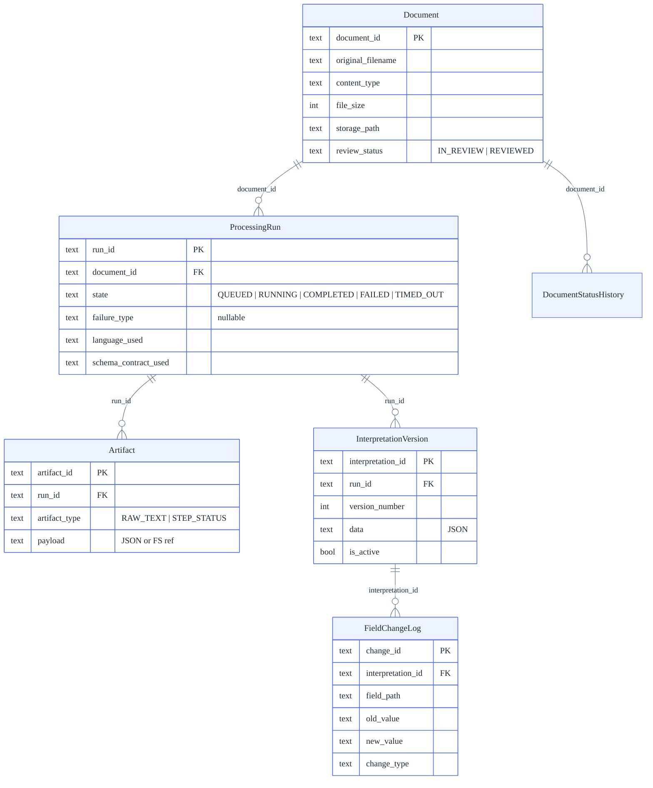
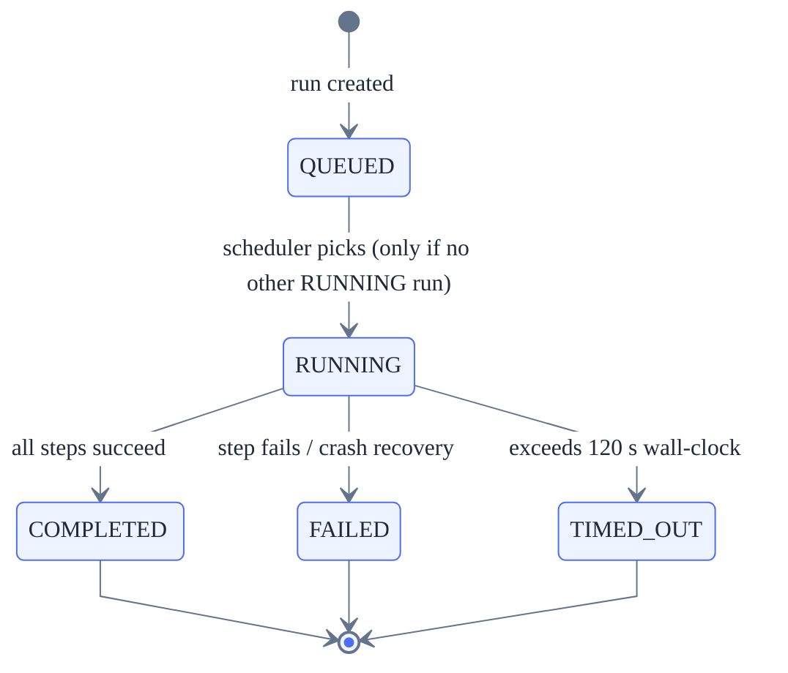

# Technical Design

> Key contracts and invariants that govern the system.
> Normative appendices (state models, API contracts, schema definitions) are in
> [technical-design-appendices](technical-design-appendices).

---

## 1. Domain Model

Five core entities plus two supporting tables.



### Key invariants

- Documents are never deleted.
- Processing runs are append-only; terminal states (`COMPLETED`, `FAILED`, `TIMED_OUT`) are immutable.
- At most one `RUNNING` run per document (enforced at persistence level via `BEGIN IMMEDIATE`).
- Artifacts are immutable and run-scoped.
- Exactly one interpretation version is active per run; edits create a new version in a single transaction.

### Persistence strategy

**Intent:** persist the minimum set of artifacts required to make the system debuggable, auditable, and safe for human-in-the-loop workflows.

| When | What is persisted | Why |
|------|-------------------|-----|
| On upload | Document metadata + initial lifecycle state | Traceability from the moment a file enters the system |
| After each pipeline step | Produced artifacts + state transition | Crash recovery — any step can be replayed from the last persisted artifact |
| On human edit | New interpretation version (append-only) | Auditability — no silent overwrites; before/after always available |

**Storage mapping (conceptual):** domain concepts map to two persistence boundaries — relational (SQLite, future PostgreSQL) for metadata, state, interpretations, and field change logs; file system for raw PDFs and extraction artifacts. This separation keeps large binary payloads out of the database while preserving transactional integrity for domain data.

---

## 2. Processing Pipeline

Two-step pipeline executed in-process ([ADR-in-process-async-processing](ADR-in-process-async-processing)).
For the full pipeline narrative with sequence diagrams, see [Event & Processing Architecture](event-architecture).

| Step             | Library    | Output                     |
| ---------------- | ---------- | -------------------------- |
| `EXTRACTION`     | PyMuPDF    | Raw text artifact          |
| `INTERPRETATION` | Regex + ML | Structured interpretation  |

### State machine



### Document status (derived, never stored)

| Condition                           | Status       |
| ----------------------------------- | ------------ |
| No runs exist                       | `UPLOADED`   |
| Latest run `QUEUED` or `RUNNING`    | `PROCESSING` |
| Latest run `COMPLETED`              | `COMPLETED`  |
| Latest run `FAILED`                 | `FAILED`     |
| Latest run `TIMED_OUT`              | `TIMED_OUT`  |

### Review status (independent of processing)

- Default: `IN_REVIEW`.
- `POST /documents/{id}/reviewed` -> `REVIEWED`.
- Any field edit -> reverts to `IN_REVIEW`.
- Reprocessing does **not** change review status.

### Scheduler & crash recovery

- In-process scheduler on a 0.5 s tick; FIFO by `created_at`.
- On startup, any orphaned `RUNNING` run -> `FAILED` with `PROCESS_TERMINATED`.
- Step retry: 2 attempts total (1 initial + 1 retry). Run timeout: 120 s.

---

## 3. Structured Interpretation Schema

Schema contract: `"visit-grouped-canonical"`.

### Top-level shape

```json
{
  "schema_contract": "visit-grouped-canonical",
  "document_id": "uuid",
  "processing_run_id": "uuid",
  "created_at": "ISO-8601",
  "medical_record_view": { "version": "mvp-1", "sections": ["..."], "field_slots": ["..."] },
  "fields": [],
  "visits": [],
  "other_fields": []
}
```

- `fields[]` -- document-scope (clinic, patient, owner, notes, report_info).
- `visits[]` -- deterministic visit grouping; each `VisitGroup` has `visit_id`, dates, and `fields[]`.
- `other_fields[]` -- explicit unmapped bucket; frontend must not reclassify.

### StructuredField

| Field       | Type                    | Notes                                   |
| ----------- | ----------------------- | --------------------------------------- |
| field_id    | uuid                    | Stable instance identifier              |
| key         | string                  | `snake_case`                            |
| value       | string/number/bool/null | Dates as ISO strings                    |
| value_type  | string enum             | `string`, `number`, `boolean`, `date`, `unknown` |
| confidence  | number 0-1              | Attention signal only; never blocks     |
| is_critical | boolean                 | Derived: `key in CRITICAL_KEYS`         |
| origin      | `machine` / `human`     | Distinguishes extraction vs edit        |
| evidence    | `{page, snippet}`       | Optional; approximate by design         |

### Visit-scoped keys

`symptoms`, `diagnosis`, `procedure`, `medication`, `treatment_plan`, `allergies`, `vaccinations`, `lab_result`, `imaging` -- must appear inside `visits[].fields[]`, never in top-level `fields[]`.

### Unassigned rule

Fields that cannot be linked to a specific visit go under a synthetic `VisitGroup` with `visit_id = "unassigned"` and all dates null. This prevents UI-side heuristic grouping.

---

## 4. Confidence Contract

Each field carries `confidence` (0-1): a stored attention signal, never a correctness guarantee.

### Policy

| Parameter       | Value               |
| --------------- | ------------------- |
| Bands           | low < 0.50, mid < 0.75, high >= 0.75 |
| Label-driven    | 0.66                |
| Fallback        | 0.50                |
| Hysteresis      | boosted enter 0.82 / exit 0.74; demoted enter 0.38 / exit 0.46 |
| Min volume      | 5                   |

### Tooltip breakdown (MVP)

- `field_mapping_confidence` -- primary veterinarian-facing signal.
- `field_candidate_confidence` -- pre-mapping reliability (percentage).
- `field_review_history_adjustment` -- signed percentage-point delta from calibration.
- Composition: `field_mapping_confidence = clamp01(candidate + adjustment / 100)`.

### Reviewed signal

When a document is marked reviewed and a field is unchanged, a weak-positive signal is emitted for that mapping in context. Effects are prospective only.

---

## 5. Security Boundary

Authentication is **optional and minimal** by design.

| Control              | Implementation                                     |
| -------------------- | -------------------------------------------------- |
| Auth                 | Optional bearer token via `AUTH_TOKEN` env var      |
| Rate limiting        | `slowapi` -- upload 10/min, download 30/min        |
| UUID validation      | All path params; prevents traversal (returns 422)   |
| Upload validation    | PDF-only, server-side MIME check, 20 MB limit       |
| Security audit in CI | `pip-audit --strict` + `npm audit --audit-level=high` |

**Production path:** OAuth 2.0 / JWT, RBAC, TLS, per-user quotas, audit logging. The hexagonal architecture supports this without modifying domain or application layers.

---

## 6. API Surface (summary)

### Document lifecycle

| Method | Endpoint                            | Purpose                        |
| ------ | ----------------------------------- | ------------------------------ |
| POST   | `/documents/upload`                 | Upload PDF                     |
| GET    | `/documents`                        | List with derived status       |
| GET    | `/documents/{id}`                   | Metadata + latest run          |
| GET    | `/documents/{id}/download`          | Download original file         |
| POST   | `/documents/{id}/reprocess`         | Create new processing run      |
| POST   | `/documents/{id}/reviewed`          | Mark reviewed                  |
| PATCH  | `/documents/{id}/language`          | Language override              |
| GET    | `/documents/{id}/processing-history`| Read-only run history          |

### Review & editing

| Method | Endpoint                            | Purpose                                    |
| ------ | ----------------------------------- | ------------------------------------------ |
| GET    | `/documents/{id}/review`            | Latest completed run + active interpretation |
| GET    | `/runs/{run_id}/artifacts/raw-text`  | Extracted text                              |
| POST   | `/runs/{run_id}/interpretations`     | Apply edits (new version, append-only)      |

### Governance (reviewer-facing)

| Method | Endpoint                                              | Purpose                       |
| ------ | ----------------------------------------------------- | ----------------------------- |
| GET    | `/reviewer/structural-changes`                        | Pending schema candidates     |
| POST   | `/reviewer/structural-changes/{id}/decision`          | Record decision               |
| GET    | `/reviewer/schema/current`                            | Current schema snapshot       |
| GET    | `/reviewer/governance/audit-trail`                    | Decision history              |

### Error semantics

All errors return `{ error_code, message, details? }`. Key HTTP codes: 400 `INVALID_REQUEST`, 404 `NOT_FOUND`, 409 `CONFLICT` (with reason: `NO_COMPLETED_RUN`, `STALE_INTERPRETATION_VERSION`, etc.), 413 `FILE_TOO_LARGE`, 415 `UNSUPPORTED_MEDIA_TYPE`.

---

## 7. Known Limitations

| # | Limitation | Mitigation |
|---|-----------|------------|
| 1 | Single-process (API + scheduler share one loop) | [ADR-in-process-async-processing](ADR-in-process-async-processing); worker profile in roadmap |
| 2 | SQLite single-writer | WAL mode + busy timeout; PostgreSQL adapter in roadmap |
| 3 | Minimal auth boundary | Optional bearer token; full authN/authZ is production evolution |
| 4 | `AppWorkspace.tsx` ~2,200 LOC | 28 hooks + 3 panels extracted (-62%); remaining LOC is render orchestration |

### Resolved

| # | Was | Resolution |
|---|-----|-----------|
| 5 | `routes.py` ~940 LOC | 6 domain modules (all < 420 LOC) + 18-LOC aggregator |
| 6 | No rate limiting | `slowapi` on upload/download |
| 7 | No DB indexes on FKs | 4 secondary indexes added |
| 8 | SQLite repo monolith (751 LOC) | Split into 3 aggregate modules + facade |
| 9 | No latency baselines | P50/P95 benchmarks; P95 < 500 ms enforced |
| 10 | Raw API errors shown | `errorMessages.ts` maps 8 patterns to Spanish toasts |
| 11 | Limited E2E (20 tests) | 65 tests across 21 spec files |
| 12 | No accessibility testing | `@axe-core/playwright` WCAG 2.1 AA; 0 critical violations |

---

## 8. Cross-Cutting Concerns

| Concern           | Policy                                                  |
| ----------------- | ------------------------------------------------------- |
| Error handling    | Failures explicit and classified; user-facing mapped    |
| Observability     | Structured logs only; never block processing            |
| Configuration     | All via env vars; no hardcoded secrets                  |
| Data versioning   | Append-only; never overwrite artifacts                  |
| Scope ownership   | Backend owns domain logic; frontend owns UX             |
| Data lifecycle    | Retention/deletion/export deferred to dedicated story   |

---

## Related documents

- [Appendices A–E](technical-design-appendices) -- Normative contracts, state models, API maps, schema definitions
- [Backend implementation notes](backend-implementation) -- Pre-development backend design spec
- [Frontend implementation notes](frontend-implementation) -- Pre-development frontend design spec
- [architecture.md](architecture) -- One-page system overview
- [event-architecture.md](event-architecture) -- Pipeline deep-dive with sequence diagrams
- [extraction-quality.md](extraction-quality) -- Field guardrails and quality strategy
- [ADR index](adr-index) -- Architecture decision records