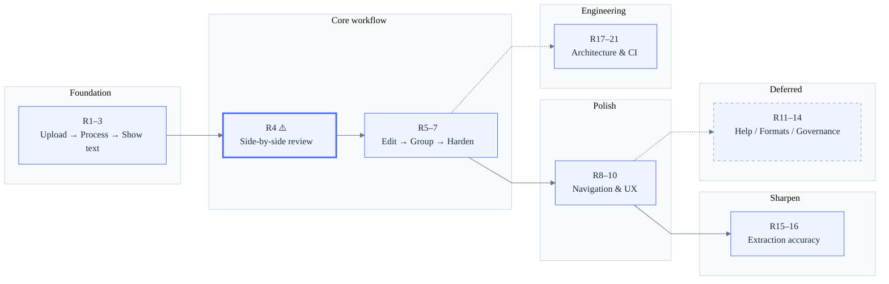

>### Note for readers:
> **⚠️ Note:** In a production environment this roadmap would live in a project management tool (Jira, Linear, etc.) where it is continuously updated as priorities shift, scope is refined, and new information emerges. This static document is a snapshot maintained for the purpose of this exercise.

# Implementation Plan

## Purpose
This plan defines releases and backlog item ordering.
Work is implemented sequentially following the release/item order in this document.

---

# Release sequencing rationale

Releases are ordered to deliver **usable increments to the veterinarian as early as possible**, balancing value, risk, and effort at each step.

| Phase | Releases | Strategy | Risk profile |
|-------|----------|----------|-------------|
| Foundation | 1–3 | Thin testable layers: upload → processing → raw text visibility | Low — no interpretation logic |
| Core workflow | **4** | Side-by-side review with per-field confidence. This is the product's differentiator. Placed early because every subsequent feature depends on it. Higher risk, mitigated with progressive enhancement and graceful degradation | **High (accepted)** |
| Core workflow | 5–7 | Happy path editing → visit grouping → data-loss protection. Shipped in order of speed-to-value, then reinforced | Medium → Low |
| Polish | 8–10 | Evidence navigation, extraction tuning, UX ergonomics | Low — refines what works |
| Deferred | 11–14 | Help, additional formats, schema governance, research. Adds breadth, not depth — deferred to keep focus on the review-edit loop | N/A |
| Extraction sharpening | 15–16 | Golden-loop field expansion and multi-visit detection. Sequenced after the review surface exists so accuracy gains are immediately visible | Low |
| Engineering quality | 17–21 | Architecture, CI gates, documentation. In practice interleaved with feature work; grouped here for clarity | Low |

## Release 1 — Document upload & access

### Goal
Allow users to upload documents and access them reliably, establishing a stable and observable foundation.

### Scope
- Upload documents
- Persist original documents
- Initialize and expose document status
- Download and preview original documents
- List uploaded documents with their status

### User Stories (in order)
- US-01 — Upload document (API)
- US-02 — View document status
- US-03 — Download / preview original document
- US-04 — List uploaded documents and their status

---

## Release 2 — Automatic processing & traceability

### Goal
Automatically process uploaded **PDF** documents in a **non-blocking** way, with full traceability and safe reprocessing.

### Scope
- Automatic processing after upload (PDF)
- Explicit processing states
- Failure classification
- Manual reprocessing
- Append-only processing history

### Format support note
Supported upload types are defined by [`docs/projects/veterinary-medical-records/02-tech/technical-design.md`](technical-design) Appendix B3. DOCX and image format expansion are sequenced as the final stories (US-19 and US-20).

### User Stories (in order)
- US-05 — Process document
- US-21 — Upload medical documents (end-user UI)
- US-11 — View document processing history

---

## Release 3 — Extraction transparency (trust & debuggability)

### Goal
Make visible and explainable **what the system has read**, before any interpretation is applied.

### Scope
- Raw text extraction visibility
- Language visibility
- Persistent extraction artifacts
- On-demand access via progressive disclosure

### User Stories (in order)
- US-06 — View extracted text

---

## Release 4 — Assisted review in context (high value / higher risk)

### Goal
Enable veterinarians to review the system’s interpretation **in context**, side-by-side with the original document.

### Scope
- Structured extracted data
- Per-field confidence signals
- Evidence via page + snippet (approximate by design)
- Side-by-side document review
- Progressive enhancement (review usable even if highlighting fails)
- Non-blocking, explainable UX

### User Stories (in order)
- US-07 — Review document in context
- US-34 — Search & filters in Structured Data panel
- US-35 — Resizable splitter between PDF Viewer and Structured Data panel
- US-38 — Mark document as reviewed (toggle)

---

## Release 5 — Editing & learning signals (human corrections)

### Goal
Allow veterinarians to correct structured data naturally, while capturing append-only correction signals—without changing their workflow.

### Scope
- Edit existing structured fields
- Create new structured fields
- Versioned structured records
- Field-level change logs
- Capture append-only correction signals (no behavior change)

### User Stories (in order)
- US-36 — Lean design system (tokens + primitives)
- US-08 — Edit structured data
- US-09 — Capture correction signals
- US-41 — Show Top-5 Candidate Suggestions in Field Edit Modal
- US-39 — Align veterinarian confidence signal with mapping confidence policy
- US-40 — Implement field-level confidence tooltip breakdown (Implemented 2026-02-18)

---

## Release 6 — Explicit overrides & workflow closure

### Goal
Focus this release on visit-grouped review rendering (contract-driven) and evaluator-ready workflow closure.

### Scope
- Visit-grouped rendering when `canonical contract` with deterministic ordering and no UI heuristics
- Evaluator-friendly installation and execution packaging/runbook

### User Stories (in order)
- US-32 — Align review rendering to Global Schema template (Implemented 2026-02-17)
- US-44 — Medical Record MVP: Update Extracted Data panel structure, labels, and scope (Implemented 2026-02-20)
- US-43 — Render “Visitas” agrupadas cuando `canonical contract` (contract-driven, no heuristics)
- US-45 — Visit Detection MVP (Deterministic, Contract-Driven Coverage Improvement) (Implemented 2026-02-21)
- US-46 — Deterministic Visit Assignment Coverage MVP (Schema)
- US-42 — Provide evaluator-friendly installation & execution (Docker-first) (Implemented 2026-02-19)

---

## Release 7 — Edit workflow hardening

### Goal
Make field editing robust and predictable, preventing data loss and ensuring correct modification semantics.

### Scope
- Dirty state tracking and discard confirmation in field edit dialog
- Reset individual fields or all fields to originally detected values
- Correct modification tracking when saving the originally suggested value
- Confidence refresh after editing a reopened reviewed document

### User Stories (in order)
- US-47 — Prevent losing unsaved field edits (dirty state + confirm discard)
- US-48 — Reset field(s) to original detected value
- US-49 — Treat save of originally suggested value as unmodified
- US-59 — Refresh visible confidence after edits on reopened document

---

## Release 8 — Evidence navigation & document interaction

### Goal
Enable precise evidence inspection and text search within the document viewer.

### Scope
- Click-to-navigate from structured field to exact location in document viewer
- Full-text search within the PDF viewer
- PDF zoom controls

### User Stories (in order)
- US-50 — Navigate to and highlight field evidence in document viewer
- US-51 — Text search in PDF viewer
- US-33 — PDF Viewer Zoom

---

## Release 9 — Extraction quality & language

### Goal
Improve extraction coverage, visit detection, clinical utility, and language support.

### Scope
- Visit detection heuristic improvements
- General extraction heuristic improvements
- Patient history summary field (antecedentes)
- Document language override and reprocessing

### User Stories (in order)
- US-52 — Improve visit detection heuristics
- US-53 — Improve general extraction heuristics
- US-54 — Patient history summary field (antecedentes)
- US-10 — Change document language and reprocess

---

## Release 10 — UX polish & upload ergonomics

### Goal
Improve document interaction ergonomics and visual polish without changing core workflow semantics.

### Scope
- Document list readability and navigation
- Upload convenience (drag-and-drop + bulk)
- Toast behavior

### User Stories (in order)
- US-23 — Improve document list filename visibility and tooltip details
- US-24 — Support global drag-and-drop PDF upload across relevant screens
- US-25 — Upload a folder of PDFs (bulk)
- US-29 — Improve toast queue behavior

---

## Release 11 — Help, content externalization & i18n

### Goal
Provide comprehensive in-app help, externalize UI texts for editing/translation, and add multilingual UI support.

### Scope
- Keyboard shortcuts and help modal
- In-app help wiki and entry point
- Contextual help icons throughout UI
- UI text externalization
- Document lifecycle management (soft-delete)
- Multilingual UI and externalized settings

### User Stories (in order)
- US-26 — Add keyboard shortcuts and help modal
- US-27 — Add in-app help wiki and entry point
- US-55 — Contextual help icons with wiki links throughout UI
- US-56 — Externalize UI texts to editable files
- US-28 — Delete uploaded document from list (soft-delete/archive)
- US-30 — Change application UI language (multilingual UI)
- US-31 — Externalize configuration and expose settings in UI

---

## Release 12 — Additional formats & OCR

### Goal
Expand format support beyond PDF and add optional OCR for scanned documents.

### Scope
- DOCX and image format end-to-end support
- Optional OCR for scanned PDFs and images (depends on image support)

### User Stories (in order)
- US-19 — Add DOCX end-to-end support
- US-20 — Add Images end-to-end support
- US-22 — Optional OCR support for scanned medical records (PDF/Image)

---

## Release 13 — Schema evolution (isolated reviewer workflows)

### Goal
Introduce reviewer-facing governance for global schema evolution, fully isolated from veterinarian workflows.

### Scope
- Aggregation of pending structural change candidates
- Reviewer-facing inspection, filtering, and prioritization
- Approval, rejection, and deferral
- Canonical schema evolution governance (prospective only)
- Append-only governance audit trail

### User Stories (in order)
- US-13 — Review aggregated pending structural changes
- US-14 — Filter and prioritize pending structural changes
- US-15 — Approve structural changes into the global schema
- US-16 — Reject or defer structural changes
- US-17 — Govern critical (non-reversible) structural changes
- US-18 — Audit trail of schema governance decisions

---

## Release 14 — Research & operational readiness

### Goal
Investigate field standardization opportunities and define operational policies for production readiness.

### Scope
- Research ISO and international standards applicability to structured fields
- Define production DB reset policy for reviewed documents

### User Stories (in order)
- US-57 — Research field standardization (ISO, international recommendations)
- US-58 — Define production DB reset policy for reviewed documents

---

## Release 15 — Extraction field expansion (golden loops)

### Goal
Expand extraction coverage to all critical patient and clinic fields via the golden loop pattern, ensuring each field has dedicated fixtures, benchmark tests, labeled patterns, and normalization.

### Scope
- Pet name extraction hardening
- Clinic name extraction hardening
- Clinic address extraction hardening
- Bidirectional clinic enrichment (name ↔ address)
- Date of birth (DOB) extraction hardening
- Microchip ID extraction hardening
- Owner address extraction (active)

### User Stories (in order)
- US-69 — Extract pet name accurately (Implemented 2026-03-02)
- US-70 — Extract clinic name accurately (Implemented 2026-03-03)
- US-71 — Extract clinic address accurately (Implemented 2026-03-04)
- US-72 — Complete clinic address from name (and vice versa) on demand (Implemented 2026-03-04)
- US-61 — Extract patient date of birth accurately (Implemented 2026-03-05)
- US-62 — Extract patient microchip number accurately (Implemented 2026-03-04)
- US-63 — Extract owner address without confusing it with clinic address (Implemented)

---

## Release 16 — Multi-visit detection & per-visit extraction

### Goal
Detect all visits in a medical document from raw text boundaries and assign clinical data to each specific visit, with observability for debugging assignment problems.

### Scope
- Multi-visit detection from raw text boundaries
- Per-visit field extraction from segment text
- Visit scoping observability and documentation (conditional)

### User Stories (in order)
- US-64 — Detect all visits in the document even when dates are not in explicit fields (Implemented 2026-03-06)
- US-65 — View clinical data assigned to each specific visit (Implemented)
- US-66 — Diagnose visit-to-data assignment problems (conditional) (Implemented)

---

## Release 17 — Engineering quality & project governance

### Goal
Establish modular architecture, comprehensive test coverage, production hardening, local validation pipelines, canonical documentation, and consistent project governance conventions.

### Scope
- Architecture audit, modularization, and component decomposition
- Automated test and E2E coverage in CI
- Security, performance, and resilience hardening
- L1/L2/L3 local validation pipeline

### User Stories (in order)
- US-74 — Automated test and E2E coverage in CI (Implemented)
- US-75 — Production security, performance, and resilience (Implemented)
- US-76 — Functional L1/L2/L3 local validation pipeline on Windows (Implemented)
- US-79 — Architecture health evaluation with quantified metrics and remediation path (Implemented)

---

## Release 18 — Frontend observability for evaluators

### Goal
Enhance the frontend to provide evaluators with clear, informative processing history including state badges, per-run durations, and per-run raw text access.

### Scope
- Processing history UI enhancements (frontend-only, no backend changes)

### User Stories (in order)
- US-78 — Enhanced processing history UI for evaluator observability

---

## Release 19 — Critical architecture remediation

### Goal
Address the highest-impact architecture findings: decompose God Modules, add CI complexity gates, and close critical documentation gaps (security architecture, production deployment).

### Scope
- Backend God Module decomposition (review_service.py, candidate_mining.py)
- CI complexity and LOC gates
- Security architecture and production deployment documentation

### Items (in order)
- ARCH-03 — Add CI Complexity Gates (Implemented)
- ARCH-01 — Decompose `review_service.py` (Implemented)
- ARCH-02 — Decompose `candidate_mining.py` (Done)
- ARCH-06 — Create Security Architecture Documentation (Implemented)
- ARCH-07 — Create Production Deployment Documentation (Implemented)

---

## Release 20 — Architecture hardening

### Goal
Fix remaining hexagonal violations, improve code hygiene, add missing ADRs, close documentation gaps, and implement production security improvements.

### Scope
- Hexagonal architecture violation fixes
- Structured logging for critical paths
- Missing ADRs and documentation (ER diagram, monitoring, ADRs)
- Production authentication, dependency hygiene, and security patterns

### Items (in order)
- ARCH-04 — Fix infra→application Dependency Violation (Planned)
- ARCH-08 — Expose `_shared` Functions Publicly (Done)
- ARCH-15 — Explicitly Declare pydantic in requirements.txt (Planned)
- ARCH-22 — Parameterize PRAGMA table_info Call (Planned)
- ARCH-24 — Replace Wildcard Re-export with Explicit Imports (Planned)
- ARCH-05 — Add Structured Logging to Critical Paths (Planned)
- ARCH-09 — Add ER Diagram to technical-design.md (Planned)
- ARCH-10 — Write Missing ADRs (Implemented)
- ARCH-16 — Create Re-accretion Prevention ADR (Planned)
- ARCH-11 — Add Monitoring/Alerting Strategy Documentation (Planned)
- ARCH-13 — Implement Production Authentication (Planned)

---

## Release 21 — Architecture polish & operational maturity

### Goal
Complete remaining architecture improvements: capacity planning, content validation, frontend state management, runtime observability, operational runbooks, and configuration documentation.

### Scope
- Capacity planning and configuration reference documentation
- PDF upload content validation
- Frontend state management refactor
- Runtime metrics collection and rate limiting
- Operational runbooks

### Items (in order)
- ARCH-12 — Add Capacity Planning Documentation (Planned)
- ARCH-23 — Add Configuration Reference Documentation (Planned)
- ARCH-14 — Add Content Validation for PDF Uploads (Planned)
- ARCH-17 — Simplify extraction_observability/ Subsystem (Planned)
- ARCH-19 — Create Operational Runbooks (Planned)
- ARCH-18 — Extract Frontend State Management Layer (Planned)
- ARCH-20 — Add Metrics Collection Infrastructure (Planned)
- ARCH-21 — Add Rate Limiting to Write Endpoints (Planned)

---